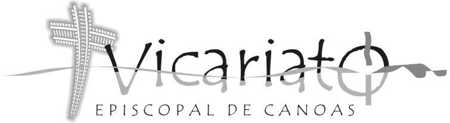
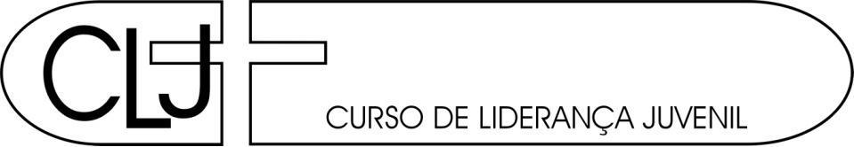
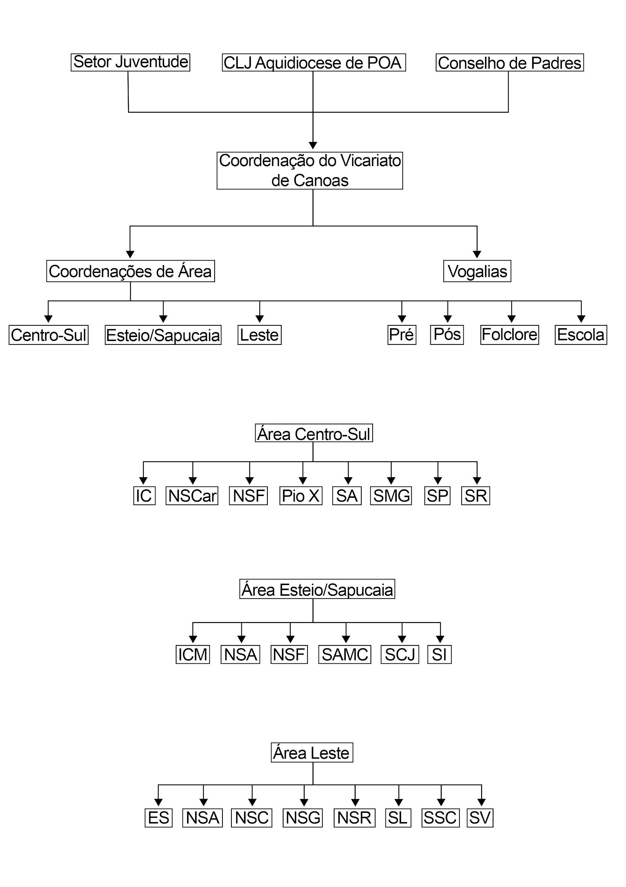
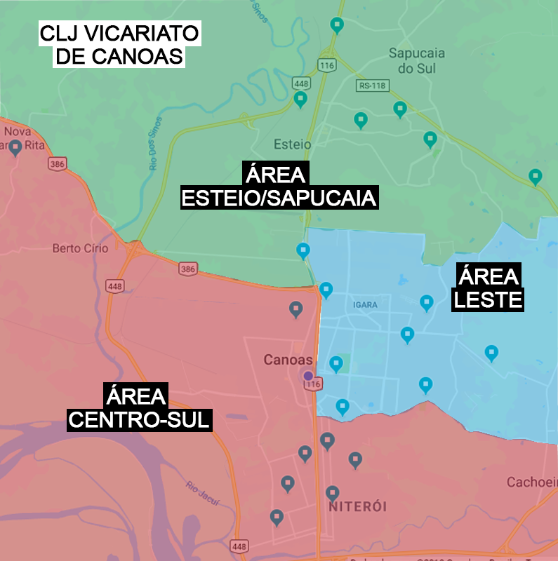
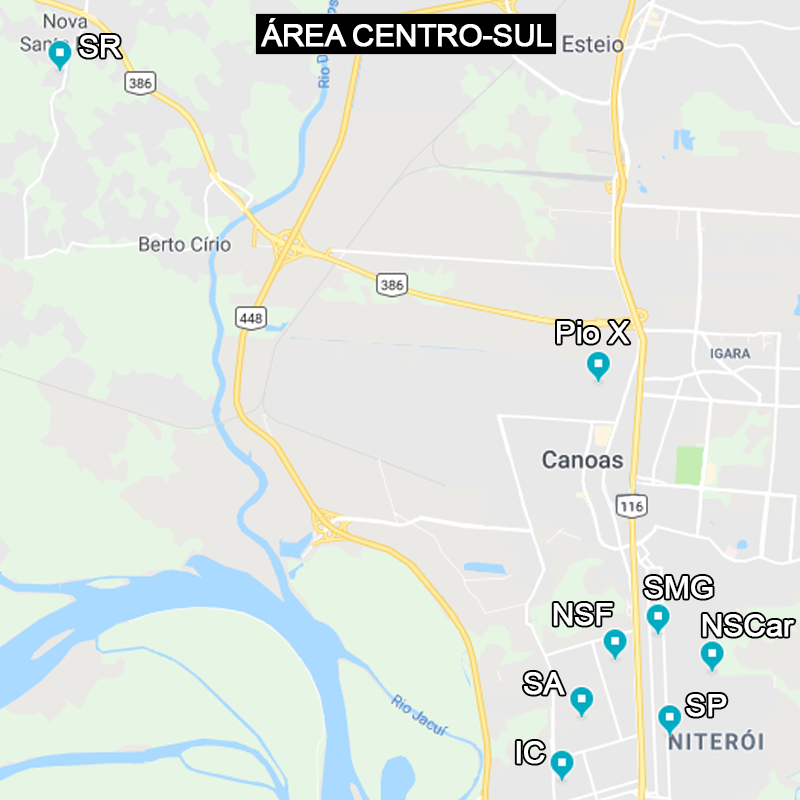
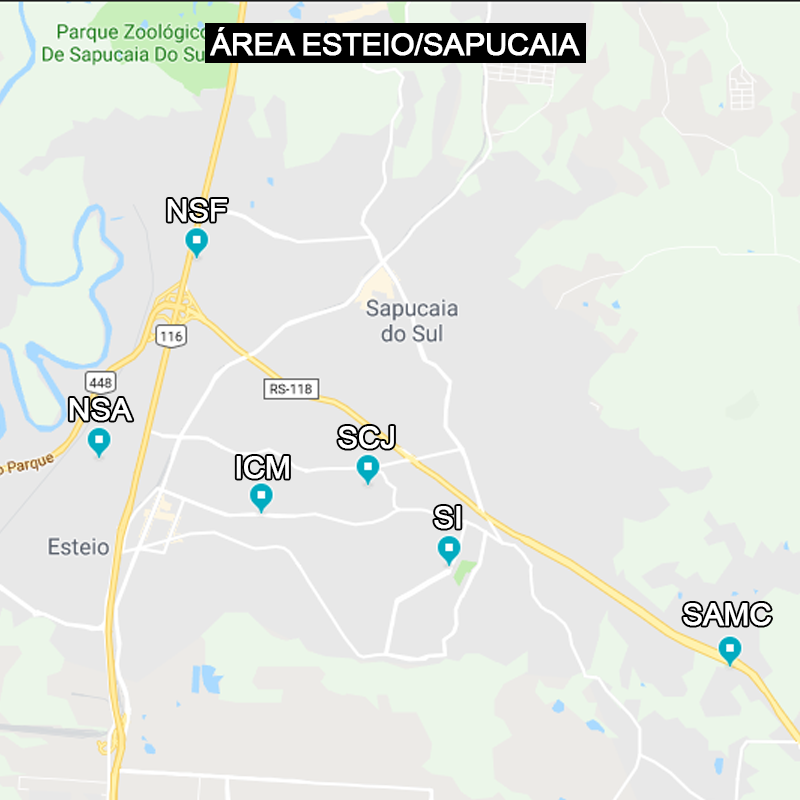
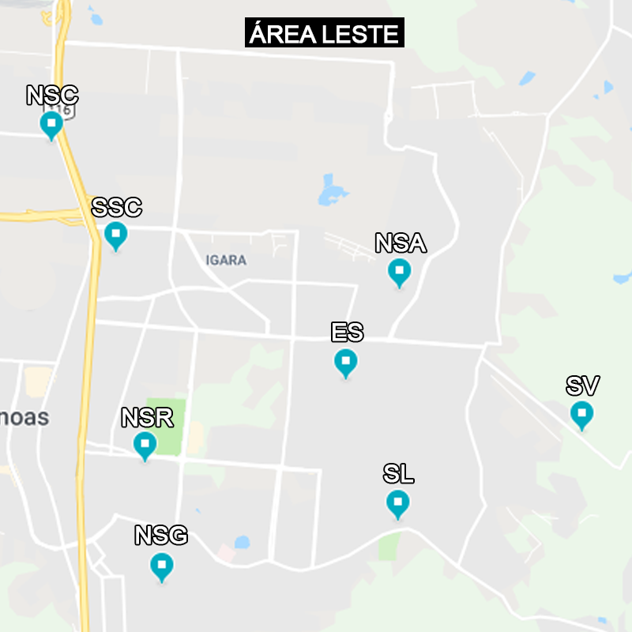
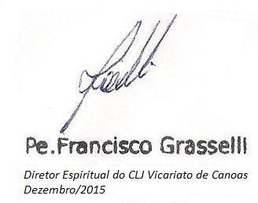

DIRETRIZES E BASES

2019 – 2020 – 2021

**Diretrizes e Bases do Vicariato de Canoas Estatuto do CLJ**

**2019-2021**

1.  HISTÓRICO DO MOVIMENTO

    1.  PORTO ALEGRE

**(Os trinta anos de um Movimento Juvenil1 – D. Zeno Hastenteufel2)**

1.  **ANOS DE TRANSFORMAÇÕES**

No início da década de sessenta, em Porto Alegre e em todo o Rio Grande do Sul,
havia uma grande pastoral da juventude. Era o período áureo da Ação Católica
Especializada.

É preciso recordar que a Ação Católica fora fundada na Europa, ainda antes da
última guerra mundial, em cima do método “ver, julgar e agir”. Esta Ação
Católica contemplava todos os segmentos da juventude. Assim existia a JAC
(Juventude Agrária Católica), a JEC (Juventude Estudantil Católica), a JIC
(Juventude Independente Católica), a JOC (Juventude Operária Católica) e a JUC
(Juventude Universitária Católica).

Estabelecendo-se mais nas cidades maiores, a JEC realmente movimentava muito a
juventude daquele tempo. Por volta de 1963, em Porto Alegre, fazíamos caminhadas
e concentrações de 15 a 20 mil jovens.

Praticamente todos os colégios católicos de então tinham os seus núcleos de JEC.
Até mesmo nos colégios públicos, como no Julinho, Protásio Alves, Parobé e
Inácio Montanha, a JEC era expressiva e havia grupos de JEC em cada turno e
coordenação própria em cada escola.

Veio a revolução de 1964, muitos líderes da Ação Católica se manifestaram
contrários aos ideais daquele movimento revolucionário e foram enquadrados nos
assim chamados “subversivos”, isto é, “perigosos” para o momento político que
então se vivia.

Grandes líderes, jovens e padres, começaram a ser perseguidos, aprisionados e,
segundo denúncias, foram até torturados. Alguns morreram, como Wladimir Herzog.
É claro que todos os grupos da JEC, JOC e JUC começaram a se posicionar contra a
revolução. Com isto a perseguição se tornou sempre mais forte e a
espiritualidade foi diminuindo. Os antigos retiros foram substituídos por dias
de encontro, debate político, estudo da realidade brasileira, contestação ao
movimento revolucionário.

Artigo publicado em *Caminhando com o Itepa, Instituto de Teologia e Pastoral,*
Ano XXIII, no. 85, julho 2007, p.46-54. (Nota do editor)

1.  Atual Bispo Diocesano de Novo Hamburgo/RS; pároco da igreja São Pedro (Porto
    Alegre), quando da criação do movimento. (Nota do editor)

Por volta de 1968, com a edição do Ato Institucional nº 5, a Ação Católica foi
colocada na parede: naqueles moldes ela não poderia continuar. Seria necessário
transformar o espírito e voltar aos ideais originários. No Brasil, isto era
impossível. Em outros países, como na Itália, na Espanha e na Argentina foi
feita esta transformação e a Ação Católica sobreviveu.

No Brasil, os próprios Bispos acabaram por desestimular uma Ação Católica que
tinha se voltado totalmente para o plano político e estava numa atitude de
ostensiva contestação. Os grupos de JEC e JUC foram acabando, lamentavelmente.
Tinham formado grandes lideranças e preparado muitos bons católicos, mas para
eles não havia espaço no momento. Criou-se um momento triste para a Igreja do
Brasil: os jovens simplesmente sumiram da Igreja.

Em 1973, como padre recém-ordenado, fui designado para trabalhar na Paróquia São
Pedro, na área central de Porto Alegre. Havia um belíssimo trabalho de
catequese, bons grupos de casais, um ativo Apostolado da Oração, mas na igreja
não havia jovens. Até existia um grupo de jovens, chamado MEF (Movimento
Estudantil Floresta), só que estes jovens não participavam da missa. A reunião
deles era no horário da missa, domingo à noite. Reuniam-se nos fundos da
paróquia, mas criticavam a Igreja e não participavam dos sacramentos.

Era um grupo que já não servia mais e que era impossível reformar. Aplicamos a
técnica da eutanásia, isto é, fizemos o grupo morrer lentamente, sem dor.

Não havia mais nada. Os jovens estavam excluídos da pastoral e todos lamentavam
a morte da antiga Ação Católica.

Em maio de 1973, veio uma pequena esperança para Porto Alegre. Graças à
preocupação de nosso bispo auxiliar, Dom Antonio Cheuíche, e com a ajuda do Pe.
Urbano Zilles, foi trazido de São Paulo o Movimento de Emaús.

Em julho, fui convidado a participar do 2º Emaús de Porto Alegre. Depois
participei do 3º, do 4º e, em abril de 1974, fui Diretor Espiritual do 5º Emaús
feminino de Porto Alegre. Em junho, daquele mesmo ano, coordenei o 1º Emaús de
Florianópolis.

Criamos um grupo de padres que refletiam a realidade da juventude. Constatamos
que os jovens eram bons, dóceis, com grande sede de Deus. Mas, vimos que, em
muitos casos, o Emaús vinha um pouco tarde. Os jovens já estavam muito avançados
e comprometidos, em droga, sexo e álcool. Em muitos casos, já era difícil uma
recuperação total e não dependia mais deles uma atitude de mudança de vida.

COMO INICIOU O CLJ 
======================

Na igreja São Pedro, nós padres tínhamos um grupo de uns 60 crismandos. Era uma
esperança para a Igreja. Eu como vigário e Mons. Atílio Fontana como pároco,
pessoalmente preparamos bem os encontros de crisma. Os jovens estudavam as
matérias, sabiam os textos, mas não havia forma de levá-los de volta à vivência
cristã. Conheciam os conteúdos da fé, mas não eram capazes de transformá-los em
vivência prática.

Em maio daquele ano de 1974, junto com a Ir. Jocélia Scherer3 e com alguns
jovens do Emaús, começamos a preparar um “retiro de crismandos”. Colocamos
algumas técnicas do Emaús, com músicas próprias, com monitores de grupos e a
participação de um casal.

Nos dias 14 e 15 de julho de 1974, com 19 jovens, oito monitores, a Ir. Jocélia
e um casal, nos dirigimos à Casa Medianeira para o “retiro de crismandos”. Seria
um retiro centralizado na pessoa de Jesus Cristo: partindo da realidade do
mundo, da realidade do jovem, apresentaríamos Jesus Cristo, com a sua Igreja e
os seus sacramentos e, à luz desta verdade, entraríamos para a realidade da
família e concluiríamos com a apresentação de um ideal jovem, num grupo
paroquial.

Tínhamos alguns esquemas em uma pasta improvisada, um coordenador jovem, com
vários bilhetes, mas sem um roteiro fixo e nem mesmo com horário claramente
estabelecido. Tínhamos um objetivo claro: apresentar um Cristo capaz de fascinar
os jovens e atraí-los para o seu caminho. Tudo correu normalmente, até que veio
a palestra sobre confissão e a grande surpresa: todos foram confessar-se. Veio a
“missa catequética” e a juventude comungando, com alegria, emoção e fé. Aquela
janta, servida em torno das 23 horas, tinha um sabor todo especial. Estava claro
que era este o caminho.

Fizemos uma reunião de monitores e todos estavam de acordo: este é o caminho
para a juventude de hoje, especialmente para os jovens depois da crisma.

No dia seguinte, apresentamos a família e a possibilidade de fundar um novo
grupo de jovens na paróquia São Pedro. Todos estavam empolgados. Mas, os jovens
queriam fazer novos retiros com esta mesma metodologia. Fizemos um trabalho em
comunidades, com a pergunta: como é que vocês chamariam um tal retiro?

Entre muitas sugestões, apareceu uma: CLJ = Curso de Liderança Juvenil. Posto no
quadro, junto com outras sugestões, foi feita a votação e não deu outra. Estava
criado o CLJ.

Os jovens queriam logo fazer outro “retiro” destes, para os colegas da crisma
que não tinham apostado no primeiro. Mas, foi então colocado, com muita clareza,
que o segundo CLJ só seria feito em novembro se até lá todo o grupo perseverasse
nas reuniões de todos os sábados, ocasião em que se faria a revisão de vida e o
aprofundamento do estudo.

Foi uma beleza, todos os sábados estavam lá os 19 jovens, mais os

monitores vindos do Emaús, o casal Raabe e Leda, mais a Ir. Jocélia. As reuniões
eram no sábado de tarde. Havia uma parte da reunião em que se preparava a missa
de domingo.

Com muito empenho, foi preparado o segundo CLJ, para os dias 13, 14 e 15 de
novembro daquele mesmo ano de 1974. Já começaria na sexta-feira de noite. Já
teríamos um livrinho de cantos, mais um casal, João e Célide Salvador, e iria um
grupo maior.

Após várias e demoradas reuniões preparatórias, pois era necessário montar todos
os esquemas de palestras e elaborar todas as intervenções do coordenador,
definir as funções do casal e do folclore4. Enfim veio a data tão esperada.

Quando encostou o ônibus, lá nos fundos da igreja São Pedro, parecia início de
uma revolução. Gente de todos os lados. Lá estavam os 55 jovens inscritos, com
seus pais, familiares e um número incalculável de curiosos. Todos queriam saber
o que estava acontecendo.

O segundo CLJ foi espetacular. Levávamos uma monitora, quase formada em
Psicologia (Luiza Rizzo). Ela deveria apresentar as alterações psicológicas do
adolescente, e observar tudo o que estava acontecendo para ver se não estávamos
contrariando o que ela aprendia na faculdade.

1.  *Religiosa franciscana, sobrinha de Dom Vicente Scherer. (Nota do autor)*

Foi um curso fora-de-série. No domingo à noite “chegada” na São Pedro. Foi feito
no salão paroquial. Estava lotado. Todos os familiares daqueles 55 jovens, os
colegas do primeiro e muitos curiosos.

E a continuidade foi melhor ainda. Muitos jovens já estavam em férias e
começaram a vir à missa todos os dias. No domingo seguinte, nosso grupo estava
assumindo oficialmente a missa das 11 horas. Era a missa dos “dorminhocos”. A
maioria chegava atrasada. Mas, em pouco tempo, se tornou a grande missa da
paróquia. Era a missa dos jovens. Os violões eram uma novidade na liturgia.
Falava-se até em “Missa iê, iê, iê...”

A partir de então, os alunos dos colégios da redondeza começaram a se
interessar. Naquele final de ano, os nossos jovens começaram a ir nas escolas e
falar aos colegas jovens sobre a experiência vivida a partir de um encontro com
Jesus Cristo. Era o assunto em todas as rodas e em todas as salas de aula.

Vieram aquelas férias e o grupo perseverando mesmo espalhados pelas praias do
litoral norte. Faziam reuniões semanais em Tramandaí, em Capão da Canoa e em
Atlântida. Não se perdeu ninguém naquelas férias. Todos voltaram em março, com
mais entusiasmo ainda. Todos estavam esperando o terceiro CLJ, logo marcado para
o mês de abril. A fama se espalhou pela cidade.

O CLJ – MOVIMENTO ARQUIDIOCESANO 
====================================

O Pe. Severino Brum, pároco da Sagrada Família, na Cidade Baixa, que há anos
estava tentando uma pastoral para os jovens, com iniciativas espetaculares,
ficou sabendo e queria participar do terceiro CLJ. Queria apenas observar e
levar um grupo de 20 jovens e um casal de tios.

Fizemos várias reuniões. Seria preciso falar com os bispos. Pe. Severino falou
com Dom Antonio e eu fui falar com o nosso Arcebispo, o Cardeal Dom Vicente
Scherer. O nosso querido Cardeal ficou um pouco assustado. Já tinha ouvido falar
“nos abraços e beijos”, durante a missa. Era uma novidade radical em Porto
Alegre.

Mas, no final de nosso encontro, ele me falou: “Pe. Zeno, continue, neste
trabalho, com a minha benção. Se este movimento vem de Deus, vai progredir e
dele surgirão muitas vocações para o sacerdócio e a vida religiosa; se não vem
de Deus, em pouco tempo vamos acabar com isto, antes que seja tarde”.

Após uma longa reunião com Dom Antonio, participando ainda o Pe. Severino, o
casal José Carlos e Eunice Monteiro, Ir. Jocélia e três ou quatro jovens, o CLJ
foi reconhecido como Movimento arquidiocesano, aberto para as paróquias que o
quisessem implantar.

O CLJ seria agora um Movimento Diocesano. Era hora de organizar tudo, preparar
as pastas, redigir os esquemas de palestras, montar o curso de dirigentes e
oficializar toda a organização. Muito importante nesta hora foi o trabalho do
jovem João Amâncio da Costa Filho que morava conosco na São Pedro.

Tínhamos uma certeza: o CLJ será um Curso de descobertas. Seria para jovens
adolescentes que viviam a fase das grandes descobertas em suas vidas. Então o
curso foi organizado em forma de cinco descobertas:

1º - O mundo: com seus problemas, seus valores e desvalores. Este é o mundo em
que nós vivemos e esta fase está centralizada na palestra “O dia de hoje”.

2º - O jovem: em uma fase de profundas transformações biológicas e psicológicas,
atraído para um mundo de ídolos e máscaras.

3º - Jesus Cristo: verdadeiro Deus e verdadeiro homem, o Pontífice, isto é,
aquele que faz a ponte que liga os homens a Deus. Diante de Cristo, o jovem dá a
sua resposta pela vivência da fé, assumindo os sacramentos, especialmente a
confissão e a comunhão.

4º - A família: o lugar privilegiado para uma educação integral, mas também o
ambiente muitas vezes cheio de conflitos e difícil. Mas, na família é possível
acontecer uma transformação rápida e profunda quando existe o diálogo e a
disposição de pais e filhos5.

5º - A Igreja: o povo de Deus, onde o jovem tem vez e voz. O jovem é Igreja e
cabe a ele apresentar a “face jovem da Igreja”, através de um grupo atuante e
transformador.

Com estes cinco pilares, o CLJ foi se firmando como “momento”, enquanto curso de
apenas três dias, e como “movimento”, enquanto grupo fixo e estável, que vai
trabalhando como pastoral de jovens, onde sempre estava presente a grande frase
de Paulo VI7: “É preciso que os jovens se tornem apóstolos de jovens”.

Em pouco tempo, o CLJ foi se espalhando pelas paróquias de Porto Alegre, depois
foi para as dioceses do interior e hoje está espalhado por grande parte do Rio
Grande do Sul7, e já recebendo pedidos para ser implantado em outros estados e
até no Uruguai.

1.  *Nos tempos em que eu estava na Europa, entre 1981 e 1984, deslocaram esta
    fase (Nota do autor)*

2.  *para antes da Descoberta de Cristo, com vantagens, só que o CLJ ficou mais
    longo, começando nas sextas-feiras de manhã, como não era originariamente.
    (Nota do autor)*

3.  *263º Papa: o surgimento do CLJ deu-se durante o seu Papado. (Nota do
    editor)*

*Serenatas das quartas-feiras8. O sábado de tarde era exclusivo para os jovens
que já tinham vivido a experiência do CLJ-Momento.*

 A REFORMULAÇÃO DAS DIRETRIZES E BASES 
==========================================

Foi em 1985, na minha volta da Europa, o CLJ estava realizando 10 a 12 cursos
por ano, em Porto Alegre, e já com secretariado próprio em Novo Hamburgo e em
Uruguaiana.

Mas, havia pouca gente refletindo sobre este crescimento e sobre a perseverança
desta juventude. Havia sérios problemas com os jovens mais antigos do CLJ,
alguns já formados na Universidade, que continuavam nos grupos paroquiais, não
dando muita chance para o surgimento de novas lideranças.

Foi então necessário formar um grupo de reflexão e realizar uma reformulação nas
Diretrizes e Bases do CLJ. Toda a reflexão começou com um grupo de jovens, mais
adultos e um casal de tios. Nossas ideias foram levadas ao Secretariado
Arquidiocesano e depois introduzidos nos grupos paroquiais.

A principal modificação introduzida foi a criação do CLJ1, CLJ2 e o CLJ3.

Por CLJ1 entendia-se o CLJ-Momento, o Curso de três dias. Era feito depois de
uma longa preparação, isto é, após uma séria caminhada dos jovens no Pré-CLJ.
Eram cerca de seis meses que o jovem deveria frequentar o Pré, para depois poder
fazer o CLJ1, isto é, o curso de três dias.

Com um ano de comprovada perseverança em reunião de grupo e trabalho

em departamento, o jovem poderia agora participar do CLJ2, um Curso de três
dias, onde aprendiam, sobretudo, a espiritualidade do movimento, a
espiritualidade do trabalho em CLJ, algumas técnicas básicas, para ser monitor,
integrante da mesa dirigente ou dar palestra. Além disso, eram abordados os
temas bíblicos, com uma introdução à leitura dos Salmos, Profetas, Novo
Testamento, Evangelhos, Atos e Cartas Paulinas. Eram cursos de grande
aprofundamento.

*7 Em Uruguaiana e na região da Fronteira, o CLJ foi implantado na década de
setenta. Também na região de Novo Hamburgo, foi implantado ainda nos tempos em
que toda aquela região da serra pertencia a Porto Alegre, entre os anos de 1976
e 1980. Na diocese de Passo Fundo, o movimento foi implantado em 1985, quando eu
recém tinha voltado de Roma e o Pe. Osvino Both trabalhava numa paróquia da
cidade de Passo Fundo. Dali depois o movimento se espalhou para Frederico
Westphalen e Vacaria, sempre sob orientação do Pe. Osvino e depois do Pe. Ivo
Barth. Em 1995, em Porto Alegre, fiquei sabendo que o movimento já estava
implantado em Frederico Westphalen. (Nota do autor)*

*8 “Serenata a Jesus Cristo”, eram as grandes missas celebradas nas
quartas-feiras à noite, onde os jovens participavam com os cantos e na homilia
ajudavam na reflexão bíblica. Era um lugar de crescimento espiritual
extraordinário. Muitos jovens já vinham antes para se informar sobre as leituras
bíblicas e já preparar alguma reflexão. Foi um tempo de grande crescimento.
(Nota do autor)*

Feito o CLJ2, o jovem poderia então trabalhar em cursos futuros, desde que
perseverasse todos os sábados e desde que estivesse atuando ativamente em algum
departamento.

Passados mais dois anos, depois de participar do CLJ2, o jovem poderia ser
convidado a fazer o CLJ3, isto é, a escola que formava propriamente os
dirigentes máximos, os Coordenadores e Bases do CLJ. Lá então os jovens
estudavam a História da Igreja, os seus diferentes momentos de luta e
sofrimento, os grandes personagens da história e a doutrina social da Igreja.
Pensávamos preparar os jovens para os desafios da Universidade. Eles deveriam
estar prontos para poder rebater os argumentos apresentados contra a Igreja e os
seus ensinamentos.

O CLJ HOJE 
==============

Em nossas dioceses, já temos vários sacerdotes provenientes das fileiras do CLJ
e nos seminários temos ainda grandes esperanças de vocações, nascidas em nosso
meio.

Em cada diocese, o CLJ tem as suas características peculiares9, de acordo com a
realidade local. Mas, no essencial, o CLJ é o mesmo, em todos os recantos deste
Rio Grande, até mesmo nas suas dificuldades de adaptação à pastoral da
juventude10 e às canções litúrgicas que as comunidades cantam. No entanto, o que
foi assumido há quase

trinta anos, como Hino do CLJ, se concretiza em toda a parte: “Unidos estamos
aqui, unidos queremos ficar... é bela a vida que se dá... É preciso que o mundo
seja um pouco melhor porque nele eu vivi e por ele tu passastes meu irmão”.

O certo é que o CLJ até hoje só nos deu alegrias e está implantado como uma
grande esperança para a Igreja. É claro que há padres e bispos mais empolgados e
outros menos empolgados com o CLJ, mas uma coisa é certa: “Nas paróquias onde
está o CLJ, lá atuam jovens e mais jovens... e lá onde não está o CLJ, há uma
enorme carência de jovens na Igreja e na participação da liturgia e no canto”.

*9 Em Porto Alegre, sempre se realizou o CLJ por áreas pastorais, agora por
Vicariatos. (Nota do autor)*

*10 A Pastoral da Juventude muitas vezes tem uma visão mais política do que
propriamente eclesial e de vivência da fé. É isto o que dificulta a participação
do CLJ, na*

*pastoral da juventude. (Nota do autor)*

PROBLEMAS DO CLJ
================

Já nos primeiros anos depois da fundação do CLJ, já começamos a perceber alguns
problemas que até hoje não estão ainda superados.

1.  Os jovens que se eternizam no CLJ: Há muitos jovens que permanecem por muito
    tempo no movimento. Passam por todas as fases e depois continuam sempre no
    CLJ, ocupando as principais lideranças, dificultando o surgimento de novos
    líderes e, por vezes, tornando-se líderes negativos no grupo.

2.  O relacionamento com a Pastoral da Juventude: Acontece que os métodos de
    trabalho são diferentes. O CLJ parte de um curso, onde as palestras falam
    linguagem direta e o anúncio de Jesus Cristo é feito em forma
    querigmática11, isto é, em forma de pregação. Diante de Cristo, o jovem faz
    a sua adesão, o aceita na fé e procura seguir o seu caminho. Na pastoral da
    juventude, o caminho é outro, é mais através de trabalhos em grupo, vão
    descobrindo aos poucos e por isso, passam sempre pelo caminho da história,
    com suas políticas e ideologias. A pastoral da juventude não raro fica neste
    caminho.

3.  O grupo paroquial tende a se fechar sobre si mesmo: Como todos os jovens
    passam pela mesma experiência de curso, fazem as mesmas descobertas e com
    isto muitas vezes os jovens se fecham em “panelinhas” ou formam um só
    “panelão” fechado, onde ninguém mais pode entrar.

4.  Tendência à estratificação: A tentação é que os jovens comecem a fazer
    grupinhos a partir dos próprios pais, segundo a classe social. Forma-se o
    grupo dos mais ricos, dos quase mais ricos, dos bastante ricos e dos
    remediados. Com isto, o grupo dos mais pobres fica de lado e formam outro
    grupo. Esta estratificação pode ser fatal para um grupo e para a imagem do
    CLJ.

5.  Deslocamento do núcleo: Esta é a pior crise do grupo, quando o núcleo
    central do CLJ vai se desviando. O núcleo central deveria ser Jesus Cristo,
    a Igreja e os Sacramentos. Entretanto, muitas vezes acontece que os jovens
    vão ao grupo para marcar as festinhas da noite, para falar das festas do
    último final de semana e deslocam o núcleo para os assuntos periféricos ao
    grupo.

Para que o grupo não se feche, há uma única solução: fazer o grupo trabalhar.
Organizar encontros e encontrões, retiros e programas com outros grupos,
organizando encontrões de área ou encontrões diocesanos. Enquanto o grupo todo
estiver envolvido, com trabalhos e tarefas, é certo que o grupo cresce e as
lideranças se fortalecem.

*11 O texto original apresenta a palavra kerigmática, com origem no idioma grego
(κήρυγμα: kérygma); porém a grafia correta na língua portuguesa é querigmática,
conforme Aurélio - Século XXI, 1999. (Nota do editor)*

1.  O CLJ EM CANOAS, ESTEIO E SAPUCAIA DO SUL

    1.  ANTIGA ÁREA CANOAS (ATÉ 2001)

Em 1978, existia o grupo UJONSG (*União dos Jovens da NSG*) na Paróquia Nossa
Senhora das Graças, em Canoas, que se reunia para trabalhar, fazer encontros e
orações. O casal, Tio Belló e Tia Marina, decidiu procurar o Pe. Zeno para
implantar o CLJ NSG. E assim se fez. Em 1980, jovens da Paróquia NSG de Canoas
fizeram o 50º e o 53º CLJ de Porto Alegre. Neste mesmo ano, havia um grupo de
jovens na Paróquia Santa Luzia chamado JUSI (*Juventude Unida a Serviço da
Igreja*) que se reunia para trabalhos na paróquia.

No ano de 1981, a Paróquia NSG participou de mais três CLJ’s por Porto Alegre,
sendo que, no 69º e no 73º, dois jovens da Paróquia SL participaram através da
Paróquia NSG. Os grupos de Canoas participavam também, das reuniões Saca Rolha,
em Porto Alegre, mas era uma realidade completamente diferente. No ano de 1983,
depois de muito trabalho, amor e doação, foi fundada a Área de Canoas, com seus
1º e 2º CLJ1. Em 3 de março de 1984, num outro canto da cidade, no então
distrito de Santa Rita, jovens levaram o Movimento para a Paróquia. No dia 6 de
maio de 1985, alguns jovens da Paróquia NSG de Canoas realizaram a primeira
reunião na Paróquia São Paulo e, logo em junho de 1986 a Paróquia SP participa
do 7º CLJ1 da Área Canoas.

Em 1987 o Movimento começou a ter a Capela Nossa Senhora Aparecida de Esteio
como integrante. Também em 1987, ocorreu o 1° CLJ2 da Área de Canoas, que foi
realizado na Paróquia NSG de Canoas.

Em 1990 ocorreu o Primeiro Congresso Estadual do CLJ. Também ocorreu o 13º CLJ1
de Canoas.

No ano de 1991, começou o movimento na Paróquia Nossa Senhora da Conceição de
Canoas, que já se fez presente no 15º CLJ1 de Canoas. Em maio deste ano, dois
jovens da Paróquia SLG resolveram começar um grupo na Capela Nossa Senhora do
Rosário de Canoas.

Em 1992, aconteceu o 17º CLJ1 de Canoas, que já teve a participação da Capela
NSR. Aconteceu neste ano a Festa de 15 anos do CLJ na cidade de Canoas.

Já em 1996, mais uma Paróquia integrou-se a Área de Canoas: Nossa Senhora
Aparecida, do bairro Guajuviras, em Canoas.

Em agosto de 1997, ocorreu o 26º CLJ1 com a presença de um novo grupo, a Capela
São Vicente, que foi apadrinhada pela Paróquia SL.

Em 1998, os jovens do CLJ de Canoas fizeram uma grande panfletagem anunciando a
outros jovens que Jesus precisa de cada um.

No ano de 2000, houve a criação do CLJ na Paróquia Nossa Senhora do Caravaggio,
já participando do 31º CLJ1 de Canoas.

ÁREA PORTÃO (ATÉ 2001)
======================

Em 1991, ocorreu a fundação de um novo grupo de jovens na Capela Santo Inácio em
Esteio: o grupo foi batizado de *Geração Jovem*.

Em 1992, o grupo Geração Jovem da Capela SI de Esteio participou do 8º CLJ1 de
Montenegro em outubro. Já em Sapucaia do Sul, um grupo de jovens se reunia na
Associação dos Moradores do Bairro João de Barro, onde ocorriam também as missas
da comunidade São Francisco de Assis de Sapucaia.

Em 1993, foi criado o grupo na Capela Coração de Jesus em Esteio. Um fato
marcante do ano de 1993 foi a criação da Área Esteio, Sapucaia e Portão a qual
teve como Diretor Espiritual o Pe. Carlos José Feeburg, pároco da Paróquia
Imaculado Coração de Maria. Iniciaram nesta nova área os seguintes grupos: NSG,
SI, CJ, Santo Antônio Maria Claret, da cidade de Esteio; São Pedro, de Sapucaia;
NSG e Santo Antônio, de Portão. Todos estes grupos inicialmente faziam parte da
Área de Montenegro, mas, devido algumas diferenças, sentiram a necessidade de se
firmar como área para ampliação do CLJ na região. O grupo de jovens da Capela
SFA de Sapucaia já participa do 1º CLJ1 da Área Esteio, em julho de 1993.

Em 1994, ocorreu o 1° CLJ2 da Área Esteio. Neste mesmo ano, os grupos de São
Sebastião do Caí (Paróquia São Sebastião e a Capela Nossa Senhora dos
Navegantes) passam a pertencer à Área Esteio, tornando-se esta a Área
Esteio-Sapucaia-Portão-Caí. (O grupo da Paróquia SS foi fundado em 1982, porém
fazia seus próprios cursos;

depois participou por um tempo dos cursos de Montenegro). A turma de Crisma da
Paróquia Nossa Senhora de Fátima de Sapucaia é convidada por jovens do CLJ da
Paróquia NSG de

Esteio e SFA a fazer parte do CLJ, e, em novembro de 1995, é criado o grupo do
CLJ na Paróquia NSF em Esteio.

Em 1996, na cidade de São Sebastião do Caí, surge o CLJ na Paróquia Nossa
Senhora da Conceição, além das capelas Nossa Senhora de Fátima e São José, de
Portão, as quais se incorporam à Área Esteio.

Em abril de 1997, o grupo da NSF passa a fazer seus encontros na paróquia, e,
após um tempo, os dois grupos de jovens da Paróquia (CLJ e JUSC) unem-se em um
único grupo, como CLJ.

Em 1998, a Paróquia NSC de São Sebastião do Caí funda o grupo de CLJ na Capela
Nossa Senhora dos Navegantes do Bairro Conceição.

Ao longo do ano de 1999, Pe. Carlos e o Pe. Inácio, da cidade de Alvorada,
conversavam sobre a possibilidade de se criar um grupo do CLJ na Paróquia Nossa
Senhora da Saúde, de Alvorada. O grupo de base já existente na paróquia foi
convidado para participar do 8º CLJ1 da área Esteio. Em agosto de 1999, a Capela
SI, de Esteio, torna-se Paróquia, sendo que o seu primeiro pároco foi o Pe.
Valdomiro, um grande incentivador da juventude em Esteio, pois já trabalhava
como auxiliar de Pe. Carlos Feeburg. Também em 1999, um grupo de cantos da
Capela Nossa Senhora Aparecida de

Sapucaia inicia um trabalho junto a Crisma para a criação de um grupo de jovens
na comunidade. Neste mesmo ano este grupo conhece o CLJ por intermédio do grupo
da Paróquia NSF e recebe o nome de ABC (*Amigos Buscando Cristo*). Participam já
do 10º CLJ1 da Área Esteio.

VICARIATO DE CANOAS
===================

O ano de 2001 trouxe como novidade a implantação dos Vicariatos, uma nova
divisão proposta pelo Arcebispo Dom Dadeus Grings para reorganizar a
Arquidiocese de Porto Alegre. Também em 2001, ocorreu o 1º ECO (*Encontro de
Coordenadores* da Área Esteio). O ano de 2001 foi marcado pela saída do grupo da
Paróquia NSS de Alvorada da Área Esteio, para a criação da Área Alvorada
juntamente com outros 4 grupos. A Área de Alvorada foi apadrinhada pela Área
Esteio-Sapucaia- Portão-Caí no seu 1º CLJ1. No mês de agosto, a Capela NSA de
Esteio torna-se Paróquia. Neste mesmo mês iniciaram-se as atividades do CLJ na
Paróquia São Cristóvão de Canoas. A área de Canoas cresceu, passando a contar
com 12 grupos. No final do ano ocorreu o 33º CLJ1 de Canoas, com a participação
de 10 jovens da Paróquia SC.

No ano de 2002, contamos com a participação do Pe. Maurício Jardim, que tentou
esclarecer os jovens sobre as mudanças que aconteceriam com a divisão da
Arquidiocese em Vicariatos.

O ano de 2003 foi marcado pela divisão do Vicariato de Canoas em 3 áreas: Leste,
Centro-Sul e Esteio-Sapucaia. Ocorreram os primeiros cursos CLJ1 organizados nas
novas áreas, sempre contando com a presença de todos os grupos do Vicariato nas
missas de chegada. Neste ano, por conta da divisão em Vicariatos, a Área Esteio-
Sapucaia- Portão-Caí realizou seu último curso juntos, o 19° CLJ1 da Área
Esteio, dividindo-se após em Área Esteio-Sapucaia, pertencente ao Vicariato de
Canoas, e Área Portão-Caí, pertencente ao Vicariato de Montenegro. Já em
novembro de 2003, ocorreu o 1º CLJ3 do Vicariato de Canoas, onde participaram os
grupos das Áreas Centro-Sul, Esteio-Sapucaia e Leste, além de alguns grupos das
cidades de Portão e a Paróquia NSC de São Sebastião do Caí.

No final do ano, ocorreu uma reunião de CLJ3 na praça em frente à Paróquia SLG
em Canoas, onde foi escolhida, sem o aval dos padres, a coordenação do Vicariato
para o ano de 2004. Porém, o ano foi encerrado com a possibilidade do CLJ não
retornar as atividades. Os grupos iniciaram o ano de 2004 recebendo uma carta
com as decisões tomadas pelos padres do Vicariato referentes ao Movimento CLJ.
Entre diversas coisas a que mais chamou a atenção foi a que os Cursos de CLJ1,
CLJ2 e CLJ3 de 2004 estavam cancelados, pois 2004 seria um ano de reflexões e
mudanças.

Ao longo do ano ocorreu um processo de reflexão de toda a juventude do Vicariato
de Canoas. Ao mesmo tempo, iniciou-se o processo de reestruturação do CLJ. O ano
de 2005 para o Movimento CLJ no Vicariato de Canoas iniciou-se em março, em
Xangri-lá, onde jovens e tios das 3 Áreas participaram do retiro para
reestruturação do CLJ.

Ao longo do processo, algumas paróquias deixaram de ter o grupo CLJ em suas
comunidades, entre os anos de 2003 e 2005. Lembramos: SLG em Canoas; NSG em
Esteio; NSA e SFA em Sapucaia do Sul.

O ano de 2006 iniciou com a reestruturação das Áreas e com a mudança dos
Diretores Espirituais das mesmas, as quais ficaram assim:

**Área Centro-Sul**: paróquias NSC, NSCar, SP e SR – Dir. Espiritual: Pe.
Ricardo - SP;

**Área Esteio-Sapucaia**: paróquias NSAe, NSF, SI e capela CJ – Dir. Espiritual:
Pe. Carlos - NSGe;

**Área Leste**: paróquias NSAc, NSGc, NSR, SC, SL e capela SV – Dir. Espiritual:
Pe. Miguel - SC, o qual também era o Diretor Espiritual do Vicariato.

Os meses de janeiro a abril de 2006 foram marcados pelos preparativos para a
realização dos cursos de CLJ1 pelas áreas, os quais ocorreram nos meses de maio
e junho. Após concluído o processo de reestruturação do CLJ1 iniciou-se a
reestruturação do CLJ2, o qual ocorreu no mês de julho, sob a orientação do Pe.
Miguel.

Em 2007, a paróquia NSA de Esteio deixa a Área Esteio e passa a fazer parte da
Área Centro-Sul, nesse ano também foi fundado com o apoio da Paróquia Santa
Luzia o CLJ da Capela Espírito Santo.

Após alguns anos sem a participação na Paróquia Nossa Senhora das Graças em
Esteio, o movimento CLJ retomou suas atividades nessa comunidade em 2008.

No ano de 2010, houve a criação do CLJ na Paróquia Nossa Senhora de Fátima em
Canoas.

Já em 2011, mais duas Paróquias integraram-se ao Vicariato de Canoas: a Paróquia
Santa Maria Gorete em Canoas e a Paróquia Imaculado Coração de Maria em Esteio.

No ano de 2012 o Vicariato de Canoas expandiu suas fronteiras e implantou o
movimento CLJ na diocese de Valença com o grupo de jovens da paróquia São Pedro
e São Paulo no Estado do Rio de Janeiro.

A Paróquia Nossa Senhora da Conceição de Canoas, acolheu o movimento CLJ com a
reimplantação do grupo no ano de 2013.

No ano de 2015, na Paróquia Santo Antônio iniciou as atividades do movimento
CLJ.

Já em 2016, mais duas paróquias acolheram o CLJ do Vicariato de Canoas, em
Canoas a paróquia Imaculada Conceição, pertencendo a área Centro-Sul e em Esteio
a Paróquia Santo Antônio Maria Claret, fazendo parte da área Esteio-Sapucaia.

No Ano de 2017 o CLJ do Vicariato de Canoas implanta seu movimento na Paróquia
São Pio X, o grupo começa suas atividades fazendo parte da área Centro-Sul.

No ano de 2019 a paróquia Nossa Senhora Aparecida de Esteio passa a fazer parte
da área Esteio-Sapucaia, consequentemente as áreas ficaram com os seguintes
grupos em atividade:

-   **Área Centro Sul** – Imaculada Conceição (IC), Nossa Senhora do Caravaggio
    (NSCar), Nossa Senhora de Fátima de Canoas (NSFc), São Pio X (Pio X), Santo
    Antônio (SA), Santa Maria Goretti (SMG), São Paulo Apóstolo (SP) e Santa
    Rita de Cássia (SR).

-   **Área Esteio-Sapucaia** – Imaculado Coração de Maria (ICM), Nossa Senhora
    Aparecida de Esteio (NSAe), Nossa Senhora de Fátima de Sapucaia (NSFs),
    Santo Antônio Maria Claret (SAMC), Sagrado Coração de Jesus (SCJ) e Santo
    Inácio de Loyola (SI).

-   **Área Leste** – Espírito Santo (ES), Nossa Senhora Aparecida de Canoas
    (NSAc), Nossa Senhora da Conceição (NSC), Nossa Senhora das Graças (NSG),
    Nossa Senhora do Rosário (NSR), Santa Luzia (SL), Santuário São Cristóvão
    (SSC) e São Vicente de Paulo (SV).

DO ESTATUTO
===========

**Embasamento**

O Estatuto do CLJ – Vicariato de Canoas, tem o objetivo de informar a todos os
membros do Pós-CLJ, tios e padres sobre o funcionamento do Movimento em nosso
Vicariato.

**Diretrizes**

1.  O Estatuto do CLJ – Vicariato de Canoas, deverá ser revisto a cada três (3)
    anos em assembleia.

2.  Cabe à Vogalia de Escola e ao Diretor Espiritual do Vicariato o
    direcionamento da revisão, bem como a organização da referida assembleia.

3.  A Vogalia de Escola deve convocar a assembleia com antecedência mínima de um
    (1) mês.

4.  Cada grupo deverá estar representado da seguinte forma: todos jovens com
    CLJ3 e CLJ2 ativos no movimento e os tios. Esta representatividade na
    assembleia visa dar aos grupos voz e voto ao que se refere às decisões
    tomadas na referida assembleia.

5.  A todos os grupos fica atribuída a função de realizar a revisão destas
    diretrizes devendo as mesmas serem entregas a vogalia de escola no prazo
    estipulado, tendo direito a voz e voto, os grupos que não se manifestarem,
    seja propondo alterações ou concordando com a permanência das diretrizes
    como estão, não terão direito a voz e voto.

6.  A votação será realizada por paróquia, ou seja, cada grupo terá direito a um
    (1) voto.

7.  Será considerado aprovado o item que, em votação, obtiver maioria simples.

8.  As questões aprovadas na referida assembleia passam a fazer parte do
    estatuto.

9.  Tendo em vista que todos os grupos devem participar da assembleia,
    entende-se que as decisões se referem a todos os grupos, portanto os grupos
    tornam-se responsáveis pelo cumprimento de todas as normas apresentadas.

10. As Diretrizes e Bases só terão validade mediante a aprovação do Diretor
    Espiritual do CLJ do Vicariato de Canoas.

DO MOVIMENTO
============

**Embasamento**

O CLJ Movimento é a vida continuada dinamicamente em grupos paroquiais. É a vida
em comunidade, assumida por todos que optaram o ideal proposto.

O CLJ Momento é um curso de três (3) dias onde se anuncia Jesus Cristo através
do método Ver – Julgar – Agir. Sendo os demais cursos (CLJ2 e CLJ3) complementos
para dar continuidade à caminhada do jovem, tanto no movimento quanto na
comunidade.

**Tentativa de especificação**

O CLJ é um movimento de Igreja, constituído de jovens e adultos. Movimento que
através de método específico, busca criar comunidades jovens decididas a serem
sinal evangelizador, especialmente sinal entre os jovens. Sinal nas famílias,
nas comunidades eclesiais mais diversificadas, nos ambientes onde os jovens
vivem e convivem. Sinal no meio do mundo. Movimento que, dentro desses
objetivos, quer oferecer aos jovens condições para a realização de sua vocação
pessoal.

**O CLJ1 é o momento, destinado a jovens de 13 a 18 anos**. Desenvolve-se em
três dias de: palestras, debates, questionamentos, atos individuais e
comunitários, que possibilitam o encontro do cursista consigo mesmo, com Deus e
com os outros. É orientado por jovens, adultos, leigos e padres. Nenhuma
descrição verbal pode oferecer uma imagem exata do curso. Para dimensioná-lo
adequadamente é necessário vivê-lo.

O objetivo é a reestruturação da vida de cada um e de todos, sobre o verdadeiro
eixo que é Jesus Cristo ressuscitado, em seu Mistério Pascal. Integrar o jovem
consciente e responsavelmente na História da Salvação. Ajudar o jovem para que
se projete como cristão na construção do mundo novo, do mundo de justiça e de
paz.

CONSTITUIÇÃO DO MOVIMENTO EM UMA PARÓQUIA
=========================================

**Embasamento**

O CLJ é um movimento paroquial. Paróquia é acima de tudo uma comunidade,
comunhão de pessoas. É um lugar de participação, um lugar geográfico onde ressoa
a palavra, e a Eucaristia é celebrada. É um lugar de reconciliação e convívio,
de acolhimento aberto, onde todos devem reconhecer-se irmãos.

É na comunidade que o CLJ se desenvolve e realiza sua meta: evangelização da
juventude. Ao jovem, como leigo e membro ativo do povo de Deus, cabe a principal
tarefa de **ser jovem apóstolo de jovem**.

A grande tarefa de conduzir os jovens até a paróquia é específico do jovem
apóstolo que já está engajado no CLJ. Os métodos são os mais variados: convidar
outros jovens para o PRÉ; trazê-los à catequese de Crisma. Ao leigo cabe a
missão específica de ser profeta, isto é, aquele que faz o primeiro anúncio, a
primeira motivação.

A paróquia é também um ponto de partida. Deve ser como toda a Igreja: aberta ao
mundo, solidária com a luta e o sofrimento dos homens, especialmente dos pobres
e oprimidos.

Os cristãos se reúnem em comunidade não só para o encontro, mas também para, de
lá, partirem como missionários do Reino. Quem os reúne é o Senhor. Mas, o Senhor
tem um ministro ordenado para reunir e presidir seu Povo. Esse ministro é o
Padre. Ele está ali no lugar do Bispo, como sinal de unidade à Igreja do Senhor.
Daí a importância do ministério do padre na paróquia e no CLJ. É ele o
coordenador nato de todas as iniciativas pastorais de sua paróquia.

**Não poderá** ser implantado o CLJ em uma paróquia, se o padre não tiver
disponibilidade para acompanhar o Movimento.

A paróquia é um lugar onde o jovem do CLJ deve sentir-se em casa.

**Diretrizes**

1.  Para que uma paróquia constitua em seu âmbito o Movimento, deve haver
    aceitação do pároco, como também, esse deve acompanhá-lo e animá-lo
    efetivamente.

2.  É importante que o padre que irá acompanhar o Movimento em uma paróquia,
    faça o Curso como padre convidado e auxiliar.

3.  Antes que seja implantado o Movimento em uma paróquia, além do padre, deve
    haver um casal de tios que, na medida do possível, já tenha feito o Curso.

4.  Na paróquia, o CLJ Movimento acontece em quatro etapas:

**1ª etapa:** É o Pré-CLJ. Esta etapa se caracteriza por ser uma preparação para
o CLJ Momento, local onde o jovem tem uma ideia básica sobre o Movimento, a
Igreja e Cristo, onde há uma experiência de vida cristã.

**2ª etapa:** Esta é chamada de CLJ1 e visa integrar cada vez mais o jovem à
realidade paroquial, fazendo com que ele se dê conta da sua missão de jovem
cristão no mundo. Esta etapa servirá como preparação para o CLJ2, culminando com
a participação do jovem no mesmo.

**3ª etapa**: É chamada de CLJ2, iniciando com a participação do jovem neste
curso, que servirá de aprofundamento da consciência do dirigente cristão no
mundo, na família, na paróquia, no grupo, atuando em todos os ambientes.

**4ª etapa**: É chamada CLJ3. Iniciará com um curso que proporcionará
crescimento e amadurecimento do jovem, preparando-o para um compromisso cada vez
mais consciente com o ser jovem apóstolo, ser jovem exemplo, ser jovem cristão e
jovem líder. Esse curso formará jovens coordenadores no CLJ, na paróquia e no
mundo.

1.  A Vogalia de Escola será responsável pela implantação de novos grupos,
    devendo organizar a Equipe Cegonha (equipe de implantação/apadrinhamento).

2.  A Equipe Cegonha deve ser formada por jovens do CLJ3 que não estejam
    comprometidos com coordenações em seus grupos, áreas, Vicariato e cursos. O
    membro da equipe cegonha passa a responder nos CLJ Momento e Movimento pelo
    grupo a qual foi designado e apenas voltará a ter vínculo com a seu grupo de
    origem no que diz respeito ao CLJ quando se desvincular da equipe cegonha.
    Apesar disso pode continuar atuando na comunidade de sua paróquia de origem.

3.  A equipe cegonha deve acompanhar e monitorar o novo grupo, em um período
    mínimo de 4 anos. (Deve se ter um planejamento desde o tempo de pré dos
    primeiros deste grupo, até a preparação dos primeiros CLJ ́s 3. É necessário
    este acompanhamento de 4 anos – 1 ano de pré, 1 ano entre o CLJ1 e o CLJ2, 2
    anos entre o CLJ2 e CLJ3)

4.  Para a implantação de um grupo novo deve-se analisar a realidade da área. Se
    a mesma terá suporte para receber o grupo. Consultar o pós CLJ3 do
    Vicariato, para ver a disponibilidade dos jovens para auxiliar na
    implantação.

5.  Grupos já implantados que apresentem alguma dificuldade para continuar as
    suas atividades, a escola, juntamente com o DE, poderá solicitar jovens que
    possuam a disponibilidade de ajudar como apoio, em função semelhante a da
    equipe cegonha, mas neste caso não haverá transferência para o novo grupo,
    podendo o jovem retornar ao seu grupo de origem quando o apoio não se fizer
    mais necessário.

Para questões de cursos o jovem cedido como apoio deverá fazer ou monitorar em
cursos somente pelo grupo atual, no qual está como apoio.

DO INGRESSO DO JOVEM NO CLJ 
============================

**Embasamento**

O Curso e o Movimento têm características próprias. Os jovens que foram
convidados e queiram participar, devem ser esclarecidos adequadamente e saber
que não é necessário ingressar no Movimento para ser Igreja.

Devem saber que o Movimento quer ser um serviço e não um grupo fechado em si
mesmo.

O Movimento busca desenvolver lideranças de serviço e não de elites sociais.
Importa registrar que há muitas formas de servir ao Povo de Deus, não somente
dentro, como também, fora do Movimento. O ingresso deve ser lúcido e consciente,
pois a partir desse momento, o jovem já é considerado integrante do Movimento.

O Movimento, para muitos jovens, é a porta de entrada para a Igreja.

**Diretrizes**

1.  Para ingressar no Movimento o jovem deve ter entre 13 e 17 anos. Casos
    particulares devem ser resolvidos com o Diretor Espiritual e a Coordenação
    do Grupo.

2.  Haverá uma ficha de inscrição, com os dados pessoais do jovem, que será
    preenchida pela Coordenação de Pré.

3.  O ingresso do jovem pode ocorrer em qualquer período do ano.

    1.  DAS REUNIÕES DE GRUPO

**Embasamento**

O grupo como Movimento está inserido em uma Comunidade Cristã, devendo
participar ativamente da mesma. O auge de todas as atividades de uma Comunidade
Católica é a missa.

O Movimento deve preocupar-se com a fundamentação cada vez mais

esclarecida, mais lúcida e consciente da opção feita por seus integrantes. Por
isso, deve oferecer alguns instrumentos, meios e condições para que isto
aconteça.

Entre os meios situam-se as reuniões de grupo. Momentos de encontros, de
vivência comunitária, de conscientização, de debates, de estudo, de planejamento
para a vida e para a ação evangelizadora. Evidentemente, haverá também momentos
de alegria, de animação e até de lazer.

Mas, acima de tudo, serão momentos de estudo e de formação. O cristão não pode
ficar num testemunho apenas transmitido em um momento.

Paulo VI, na EN 22, repetiu: “*O mais belo testemunho será impotente se não vier
esclarecido, justificado e explicado por um anúncio claro do Senhor. Se não
forem anunciados: o nome, a doutrina, a vida, as promessas, o Reino, o Mistério
de Jesus de Nazaré, Filho de Deus, não haverá evangelização verdadeira*”.

Para atender a essa necessidade, o Movimento prevê as reuniões de grupo para
aprofundamento e amplificação de conhecimento, pois o Movimento não deve crescer
apenas no número de integrantes. Ele precisa crescer em profundidade,
consciência e vida. Nas reuniões devem ser abordados os grandes temas do
Cristianismo e do homem. O desenvolvimento dos temas deve surgir das
necessidades e do nível de cada grupo paroquial.

Cada etapa, além das necessidades comuns, apresenta necessidades específicas.

Uma é a realidade do Pré, outra do CLJ1 e outra ainda do CLJ2.

Para melhor atingir as finalidades das reuniões, as coordenações de grupo devem
também estar atentas aos momentos que vivem a comunidade humana local, regional,
nacional e internacional. Os temas a serem examinados nunca deveriam alienar-se
dessa realidade. O ser cristão é mantido por uma dimensão social e comunitária.

Além do estudo, o encontro de sábado deve propiciar a integração entre os
membros do grupo.

**Diretrizes**

1.  Os grupos do Movimento se reunirão aos sábados de tarde, no recinto da
    comunidade paroquial, em horário previamente estabelecido.

2.  Recomenda-se que as reuniões semanais sejam realizadas aos sábados à tarde.
    Casos específicos ficam a critério da realidade paroquial.

3.  A Missa é imprescindível para a realização das reuniões de grupo.
    Preferencialmente o grupo deve culminar com a Santa Missa, podendo também
    começar com a mesma.

4.  Cada grupo deverá ter duas (2) atas, uma do pré e outra do pós: nas quais
    sejam registrados os membros presentes nos encontros de sábado (ata de
    presença) e preferencialmente na mesma registrar descritivamente os
    acontecimentos da tarde.

5.  Nas reuniões serão desenvolvidos temas de conteúdo teológico, alternadamente
    com outros temas de formação e informação que surjam das necessidades do
    momento.

6.  Quem decide sobre os temas a serem abordados nos momentos de estudo e nas
    palestras de sábado é a coordenação de grupo, juntamente com a coordenação
    dos departamentos de Pré e Pós em sintonia com o pároco.

7.  As reuniões de grupo devem ter uma estrutura mínima e máxima nas tardes de
    sábado, desenvolvendo o ESTUDO, a PIEDADE e a AÇÃO (TRIPÉ).

*TARDE MÍNIMA*: atividades fundamentais para a realização de uma tarde de grupo.

-   Momento de sacrário/capela, com leitura bíblica e outras atividades
    relacionadas à espiritualização (reflexão pessoal, cantos, mensagens,
    dinâmicas).

-   Avisos e informações sobre a vida e organização do grupo.

-   Um momento destinado ou ao Estudo ou à Piedade ou à Ação.

-   Santa Missa.

*TARDE MÁXIMA*: pauta geral para a boa realização de uma reunião de grupo.

-   Momento de sacrário/capela, com leitura bíblica e outras atividades
    relacionadas à espiritualização (reflexão pessoal, cantos, mensagens,
    dinâmicas).

-   Avisos e informações sobre a vida e organização do grupo.

-   Momentos de Estudo, Piedade e Ação.

1.  Exemplos de Estudo: palestras, dinâmicas de grupo, encontros de formação,
    testemunhos, trabalhos em grupo, gincana bíblica etc.

2.  Exemplos de Piedade: orações, leitura orante da Bíblia, Adoração ao
    Santíssimo, oração do terço, dinâmicas envolvendo espiritualidade,
    testemunhos etc.

3.  Exemplos de Ação: gesto concreto, gincana, arrecadação de alimentos, visitas
    a orfanatos e asilos, eventos da comunidade, ajuda a outras pastorais,
    atividades para buscar novos integrantes (escolas, pedágios) etc.

-   Folclore.

-   Lanche comunitário

-   Momento de lazer/descontração (brincadeiras).

-   Santa Missa.

1.  A ordem das atividades no decorrer da tarde pode ser alterada sempre que
    necessário.

2.  A tarde mínima é o mínimo necessário para a tarde acontecer, porém nada
    impede que se acrescentem itens à tarde mínima, tornando-a uma TARDE
    INTERMEDIÁRIA.

3.  Aconselha-se que nas tardes máximas, haja momentos de separação entre os
    departamentos de Pré e de Pós.,

4.  Por respeito aos membros do grupo, a coordenação fará com que se observe
    horário certo para iniciar e concluir os encontros, programando trabalhos e
    fazendo com que sejam obedecidos os intervalos.

    1.  REUNIÕES DE COMUNIDADE

**Embasamento**

O grupo, a comunidade, constitui uma exigência humana. O ser humano desde sempre
se reuniu para conseguir sua sobrevivência e desenvolvimento. A Igreja, criada
com homens e para homens, não pode fugir a sua condição. O próprio ser da Igreja
é comunidade. A comunidade é uma exigência do ser cristão.

Se buscarmos nos Atos dos Apóstolos a descrição da Igreja nascente,
encontraremos uma comunidade assídua à palavra dos “doze”, à comunhão fraterna,
à fração do pão e às orações. Eles viviam em comum.

Percebe-se que as Reuniões de Comunidade não são uma invenção do Movimento.

A Reunião de Comunidade é a própria alma do Movimento, onde habita o Espírito do
Senhor que dá vida a todo o grupo para dar testemunho de vida cristã. Na Reunião
de Comunidade surgem amizades fortes com confiança mútua.

A Reunião de Comunidade, ao ir conseguindo a vivência verdadeira, contínua e
progressiva do fundamental cristão, vai garantindo a autenticidade do Movimento,
pois não são as estruturas que vão dar vida ao Movimento e sim através de
comunidades vivas, vai desenvolver e garantir a vida que o Movimento busca viver
e transmitir como instrumento. As comunidades são o Movimento vivo. A Reunião de
Comunidade torna realizável a vida em comunidade.

Num primeiro passo, se forma e se reúne o grupo, criando condições de trabalho.
Surgem as amizades e a confiança. Pelo conhecimento mútuo, pela partilha e pelo
conviver brota a confiança, condição essencial para subsistir uma comunidade
viva. Essa comunidade vai ser a respiração do Movimento.

A reunião assídua vai possibilitar a vivência verdadeira, contínua, comunicante
e progressiva do Reino, entre seus membros. Compartilhando, revisando,
ajudando-se, os

integrantes da comunidade entram em comunhão, realizam o ser cristão em si e
tornam- se sinal para os demais.

Compartilhar não significa somente contar coisas. Compartilhar é participar,
tomar parte em fazer-se participante de repartir. Compartilhar o que se é, o que
se faz, o que se fará. E até o que se tem. Assim, a Reunião de Comunidade se
torna momento alto de evangelização. Não se vai à reunião apenas para receber,
mas para dar também. Isto é evangelizar. É ser Igreja.

O simples contar não faz comunhão. Não faz comunidade. Pode fazer reunião, mas
não comunidade. Por uma ideia imperfeita de Reunião de Comunidade é que muitos
não a compreendem e nem sequer suspeitam de sua força e de sua beleza.

O grande grupo, a grande comunidade não pode oferecer oportunidade prática de
compartilhamento interior mais profundo. Daí a necessidade de uma comunidade
menor, da Reunião de Comunidade. O ser humano postula um relacionamento
profundo, uma comunicação em nível de interioridade real, para que haja uma
realização pessoal, comunitária.

A comunidade de fé é lugar privilegiado para comunicação do Espírito do Senhor.
E essa abertura à ação de Deus leva à comunhão e participação. Liberta do
egoísmo e faz buscar a justiça e a fraternidade.

**Diretrizes**

1.  Os grupos paroquiais do Movimento, após cada Curso, providenciarão a
    formação das novas comunidades, de rapazes e moças separadamente. Caso não
    se tenha um mínimo de duas (2) pessoas do mesmo gênero, a pessoa será
    incorporada em outra comunidade indicada pela coordenação de pós do grupo.

2.  Cada comunidade elege um animador ou uma animadora que deverá conduzir as
    reuniões. O primeiro animador deverá ser um jovem mais antigo do grupo,
    preferencialmente que tenha vivido o CLJ Momento com esses jovens. Este
    animador acompanhará a comunidade nos seis meses subsequentes ao curso. A
    partir daí sempre serão escolhidos novos animadores para as comunidades,
    preferencialmente, essa troca deve ocorrer anualmente.

3.  As reuniões de comunidade podem ocorrer em qualquer dia da semana, sendo que
    deverão ocorrer preferencialmente dentro do ambiente paroquial, caso não
    seja possível, deve se ter a autorização do Diretor Espiritual para
    realização em outro local.

4.  Seja qual for a função do jovem, para poder trabalhar em Cursos, deve estar
    fazendo regularmente a sua Reunião de Comunidade.

5.  A função das reuniões de comunidade é a revisão da vida espiritual, a
    participação eclesial e sua atividade apostólica.

6.  Ao menos nos primeiros meses, as comunidades devem seguir o roteiro da Folha
    de Vivência, que é instrumento de avaliação do crescimento na fé, através da
    análise do comportamento no estudo, piedade e ação.

    1.  DOS DEPARTAMENTOS

**Embasamento**

Se considerarmos que a Coordenação de Grupo é o coração do grupo paroquial, os
departamentos são os demais órgãos, sendo tão vitais a este grupo quanto os
órgãos ao corpo humano.

É necessário que os departamentos funcionem bem, devendo seus membros zelar pela
sua “saúde” porque se um órgão adoece compromete o funcionamento de todo o
corpo.

Deus fez cada ser humano único, especial. O CLJ não poderia desvalorizar esse
aspecto, por esse motivo existem diferentes departamentos, para que, deste modo
cada jovem explore ao máximo seu potencial, contribuindo com seu talento no
departamento adequado, sendo assim sinal evangelizador, transformando o grupo
paroquial na ponte que leva os jovens da comunidade a conhecer o maravilhoso
caminho que a juventude cristã trilha para a construção do Reino de Deus.

O Senhor nos fala através do apóstolo Paulo, em 1Cor 12,4ss, que “*há
diversidade de dons, mas o Espírito é o mesmo. E há diversidade de ministérios,
mas o Senhor é o mesmo. E há diversidade de operações, mas é o mesmo Deus que
opera tudo em todos*”.

Refletindo o trecho, percebemos que, mesmo sendo os departamentos tão
singulares, é o mesmo Deus que age em todos, e que apesar das diferentes funções
que exercem no grupo paroquial trabalham pelo mesmo ideal, logo, como os órgãos
do corpo humano que trabalham numa fascinante sincronia, é crucial ao grupo que
seus departamentos trabalhem em perfeita harmonia entre si e com a Coordenação
de Grupo.

**Diretrizes**

1.  Os departamentos que devem existir essencialmente nos grupos

paroquiais são os seguintes: Pós, Pré, Cultural, Liturgia, Bem-Estar e Folclore.
É possível a fusão de departamentos quando a realidade da paróquia assim o
exigir.

1.  Todo Pós-CLJ deve estar inserido obrigatoriamente em um dos seguintes
    departamentos: Bem-Estar, Cultural ou Liturgia.

2.  Quando o jovem retorna do Curso CLJ1 escolherá obrigatoriamente um dos
    departamentos citados no item b.

3.  Todos os integrantes dos departamentos de Pré e Pós deverão ter feito
    preferencialmente o CLJ2 e deverão obrigatoriamente ser perseverantes no
    grupo.

4.  Conforme a realidade da paróquia, outros departamentos podem ser criados,
    como por exemplo: Busca, Vocação etc., desde que não altere o funcionamento
    normal dos demais departamentos, ou seja, o jovem não pode abandonar seu
    departamento de origem.

5.  Cada departamento realizará reuniões mensais, no mínimo, para organizar o
    mesmo. Também deve existir oração e estudo em relação às atividades do
    departamento nas reuniões.

6.  Os departamentos devem observar o cronograma geral do grupo para que sua
    organização esteja de acordo com o mesmo.

7.  Cada departamento terá um coordenador e um base, sendo estes,
    preferencialmente, CLJ2. Para coordenar o Departamento do Pós, o jovem
    deverá ser CLJ3, na impossibilidade disso poderá ser um jovem com CLJ2.

8.  Para ser coordenador é necessário que o jovem tenha, no mínimo, seis (6)
    meses de vivência no departamento.

9.  Os coordenadores de departamentos organizam as reuniões dos mesmos e
    distribuem as funções a serem realizadas pelos integrantes. Também organizam
    momentos de estudo sobre as atividades realizadas pelo departamento. No caso
    do Folclore, também organiza os momentos de ensaio.

10. Caso seja necessário haver mudança de departamento, essa deverá acontecer
    somente com justificativa e mediante autorização da Coordenação de Grupo. A
    Coordenação de Grupo deve usar o bom senso para decidir sobre a
    transferência. Sugere-se que essa mudança de departamento ocorra somente no
    final de cada ano.

11. Qualquer jovem pode participar do Departamento de Folclore inclusive o
    participante do Pré-CLJ, basta que domine algum instrumento, e se Pós-CLJ
    que não abandone as atividades de seu(s) outro(s) departamento(s).

12. As funções dos departamentos são:

**Folclore**: é responsável por tudo que é relacionado à música dentro do
Movimento. É responsável pela alegria do CLJ. É composto por todos os jovens que
tocam algum instrumento musical. Devem ensaiar cantos para momentos de
“folclore”, para momentos de espiritualidade e para animar a Santa Missa. É
responsável também pela criação e manutenção dos livros e folhas de cantos.

**Bem-Estar**: cuida do bem-estar dos integrantes do grupo, organizando o
ambiente. É responsável pela: acolhida, lembranças, murais de aniversários,
organização do lanche e todas as atividades relacionadas ao bem-estar do grupo.

**Cultural**: organiza e apresenta todas as informações culturais para o grupo.
Essas informações podem ser apresentadas ao grupo de diversas maneiras, tais
como: jornais, murais, biblioteca, teatros, filmes e outras formas de transmitir
cultura e informação. É responsável por tudo que é referente à comunicação,
informação e cultura.

**Liturgia**: é responsável por todas as atividades relacionadas à
espiritualidade do grupo e como o próprio nome sugere, é responsável por todas
as atividades litúrgicas. Atividades como: sacrários/capelas, orações,
Adorações, organização da Liturgia da Santa Missa e outros momentos de
espiritualidade concreta.

**Pós**: deve propiciar momentos de estudo, piedade e ação ao Pós- CLJ. Deve
pensar em estudos e atividades específicos para o CLJ1 e para o CLJ2. É
responsável por organizar momentos, dentro da tarde de sábado, para a realização
de Reuniões de Comunidade e Reuniões de Departamento, como também para momentos
de estudo. É interessante que, no mínimo uma (1) vez por mês, uma reunião de
Comunidade e uma Reunião de Departamento sejam realizadas dentro da Tarde de
Sábado.

**Pré**: deve preparar o Pré-CLJ para o Curso CLJ1. Deve propiciar momentos de
estudo e integração aos jovens que estão ingressando no Movimento. É importante
que faça fichas dos jovens do Pré-CLJ.

DO PÓS
======

**Embasamento**

Ser Pós-CLJ é estar em busca constante, através de sua Comunidade, do ideal de
ser Evangelho vivo para os irmãos.

Assim como nos diz Bento XVI: “*Como cristãos, cada um de nós, membro do Corpo
de Cristo, recebeu a tarefa de anunciar o seu Evangelho até os confins da terra,
isto é, transmitir aos homens e mulheres deste tempo uma Boa Nova que não só
ilumina, mas muda a vida: o próprio Cristo, ressuscitado, vivo!”*.

Ser Pós-CLJ é como buscar ser o próprio Cristo. Afinal você pode ser o único
Evangelho que o seu irmão lê.

O jovem deve viver no seu dia-a-dia de Pós-CLJ a experiência da “escadinha”, ou
seja, deve ser o mais humilde dos servos entre os seus irmãos.

**Diretrizes**

1.  O jovem do Pós-CLJ será exemplo de perseverança e atitudes ao Pré-CLJ.

2.  Terá responsabilidade ao assumir as tarefas relacionadas ao seu departamento
    e ao grupo em geral.

3.  Será um participante ativo da Santa Missa, semanalmente, conforme o 3º
    Mandamento da Lei de Deus.

4.  É necessário que cumpra pontualmente com os horários estipulados, sejam de
    reuniões, passeios, tardes de grupo etc.

5.  Estará inserido em uma comunidade e ser atuante em seu departamento.

6.  Terá iniciativa e liderança em relação ao que deve ser realizado em seu
    grupo.

7.  A idade máxima para a permanência do CLJ é 25 anos de idade, exceto se o
    jovem estiver comprometido com alguma coordenação de curso no ano vigente ou
    no ano seguinte, ou seja, parte da vogalia de escola ou equipe cegonha.
    Tendo em vista que o movimento é um Curso de Liderança Juvenil e que a idade
    máxima recomendada para a vivencia do CLJ momento seja 18 anos julgamos que
    o período de até os 25 anos de idade é adequada para que o jovem auxilie nas
    atividades do CLJ como movimento e momento e para que se insira em outras
    pastorais da sua comunidade, afim de dar continuidade da sua caminhada como
    cristão.

DOS PADRINHOS 
==============

**Embasamento**

Os padrinhos são como anjos dentro do Movimento. São pessoas escolhidas para
assessorarem os Pós-CLJ e Prés-CLJ mais novos em sua caminhada.

São pessoas atuantes em seus grupos paroquiais. Para assim poderem ser exemplos
para seus afilhados. Devem dar testemunho do Evangelho a todos. Devem ser bons
exemplos de Pós-CLJ, sendo especialmente jovem apóstolo de jovem.

**Diretrizes**

1.  Os padrinhos são responsáveis pelo jovem dentro do Movimento. Auxiliam nas
    dúvidas e dificuldades que o jovem possa ter ou encontrar ao longo de sua
    caminhada.

2.  O padrinho é exemplo de perseverança e trabalho para o(a) afilhado(a).

3.  Para poder ser escolhido como padrinho o jovem Pós-CLJ precisa participar
    frequentemente da Santa Missa e estar ativo em seu departamento e em sua
    comunidade. Deve estar em acordo com a Doutrina da Igreja e com o Evangelho.

4.  Participa da visitação à casa do(a) afilhado(a), com a presença de ao menos
    um (1) tio e um jovem experiente, no período que antecede o CLJ1 para
    conversar com os pais do mesmo e preencher a ficha de inscrição para o
    curso.

5.  Organiza a equipe que irá “arrumar” o quarto do(a) afilhado(a) durante o
    final de semana do curso.

6.  É responsável pela recolha das mensagens (família, padrinho e grupo) que são
    entregues ao(à) afilhado(a) no curso.

DOS TIOS 
=========

**Embasamento**

O CLJ é um Movimento do Povo de Deus, que não se constitui só de jovens, mas
também de adultos que possam dar seu testemunho de vida em família e em
comunidade. Fundados nessa compreensão, os jovens querem representantes adultos
no Movimento, assim é que eles se sentirão povo. Sabem que nem somente eles e
nem somente os adultos representam o Povo do Senhor.

Com essa visão, desde o começo, o Movimento foi integrado também por alguns
cristãos adultos, vocacionados a caminhar lado a lado com os jovens e com eles
ser sinal evangelizador.

A denominação de “tios” dada pelos jovens aos adultos baseia-se no costume
existente na época da fundação do Movimento. Os jovens chamavam de tios os pais
de seus amigos. O termo era rico em amizade e o costume foi integrado ao
patrimônio humano do Movimento.

Os tios participam de todas as atividades do grupo paroquial, cabendo-lhes a
missão de assessoramento, além de desempenharem as funções para as quais foram
eleitos na forma destas diretrizes.

Os tios não devem agir de forma autoritária, mas sim com a autoridade que lhe
vem revelada por Jesus Cristo no Evangelho, procurando através de suas
experiências e suas vivências mostrar aos jovens o caminho que Cristo nos
oferece na sua Igreja.

Os tios deverão buscar o aprofundamento de seus conhecimentos sobre a Doutrina
da Igreja Católica Apostólica Romana, e todas as opiniões que emitirem deverão
sempre estar de acordo com o evangelho e com Doutrina da Igreja, mesmo que sua
opinião pessoal seja diferente.

**Diretrizes**  

1.  Tios são adultos que assumiram sua condição de cristãos e, como tais,
    participam do Movimento.

2.  Para participar, os tios podem ser convidados tanto pelo Diretor Espiritual
    quanto pela coordenação de grupo, ambos de acordo.

3.  O tio deverá ser casado, no mínimo, há cinco (5) anos, e ter uma vivência
    ativa na comunidade paroquial e, preferencialmente, ter filhos.

4.  Considerando, ainda, o tópico anterior, pessoas desquitadas, divorciadas, de
    segunda união ou união estável poderão participar do Movimento, apenas não
    podendo participar de casal Bem-Estar de curso CLJ1.

5.  É aconselhável que os tios novos façam o primeiro CLJ2 que houver após o seu
    ingresso no Movimento. Não havendo a garantia da presença destes tios no
    curso, os mesmos devem comparecer nas formações dos tios proporcionadas pela
    Escola.

6.  Todas as atividades do CLJ devem ter o acompanhamento dos TIOS.

7.  Devem os adultos, integrantes do Movimento, participar de todas as
    atividades do grupo, especialmente as reuniões de sábado, desempenhando a
    função de assessores.

8.  Os tios deverão apoiar, ajudar, incentivar e participar do Movimento sem
    tomar decisões autoritárias. Porém eles têm autoridade em consenso com os
    jovens e com o Diretor Espiritual.

9.  Os tios terão voz em todas as reuniões, porém não terão direito a voto.
    Exceto quando não houver CLJ3 no grupo ou quando tiver apenas um e ele
    estiver envolvido na votação. Quando houver dois ou mais CLJ3 no grupo os
    tios não terão direito a voto. Isto se dá por dois motivos. Primeiro, porque
    em se tratando o CLJ de um Curso de Liderança Juvenil, com a participação
    direta dos tios através do voto, haveria uma descaracterização do objetivo
    de desenvolver essa liderança. Segundo, porque uma vez que houvesse um voto
    eles tomariam partido de um determinado ponto de vista, contrariando sua
    verdadeira função que deve ser a de conciliador, usando como referência a
    visão do Evangelho e da Doutrina da Igreja.

10. Os Tios têm o direito e o dever de intervir, quando uma atitude de um jovem
    foge da normalidade. A opinião dos Tios deve ser ouvida e respeitada,
    procurando sempre entrar em consenso harmonioso.

11. Os tios não devem ser alvo de nenhuma votação. Cabendo a eles próprios
    conversar com a Coordenação do Grupo e o Diretor Espiritual para definir
    quando haja necessidade de preencher alguma função ou cargo.

12. É importante que ocorram encontros periódicos de estudo e formação entre os
    tios que assessoram o Movimento no Vicariato.

DOS ÓRGÃOS DO MOVIMENTO 
========================

**Embasamento**

O CLJ surgiu, na Igreja Particular de Porto Alegre, como uma de suas expressões
de evangelização. Segundo o Compêndio do Catecismo da Igreja Católica,
entende-se

como Igreja Particular “*a Diocese formada pela comunidade dos cristãos que
estão em comunhão na fé e nos sacramentos com seu Bispo, ordenado na sucessão
apostólica e com a Igreja de Roma*” (2005, p. 62, questão 167). O CLJ surgiu
como um movimento, não como uma associação a mais.

O Movimento por ser um grupo humano necessita de um mínimo de organização e
estrutura, porém deve-se salientar que sua principal finalidade é servir,
humanizar e divinizar a todos.

Os órgãos que o CLJ prevê para sua organização em nível de Vicariato são:
Coordenações de Grupo, Coordenações de Área e Coordenação de Vicariato.

A Coordenação do Vicariato é o órgão que liga formalmente o Movimento ao seu
Vigário Episcopal, representante do Bispo, ao serviço apostólico que vem dos
“Doze”. O CLJ só pode ser Igreja se tiver o selo dos Apóstolos. O CLJ tem
consciência de que sem o vínculo apostólico não pode ser plenamente Igreja.

Compreende-se que a Coordenação do CLJ do Vicariato de Canoas, como coordenação
de um movimento integrado na Pastoral da Igreja e movimento paroquial, tenha por
membros natos os sacerdotes que assistem o Povo de Deus nas paróquias onde
existem grupos do Movimento.

Dentro dessa compreensão, no Vicariato de Canoas há um Conselho de Padres. E é
esse conselho que vai confirmar os membros da Coordenação do CLJ do Vicariato.

As Coordenações são investidas de autoridade. Sem autoridade, seriam um órgão
inútil. Mas a autoridade no CLJ significa serviço. Tem por missão procurar a
realização do mistério da unidade, na diversidade. Tem por missão valorizar,
auxiliar, canalizar e impulsionar os carismas de cada um dos integrantes do
Movimento ou do grupo. Tem por missão servir para que o Movimento ou o grupo
permaneça fiel ao seu destino.

**Diretrizes**

1.  Por tratar-se de um movimento da Igreja Apostólica de Cristo, todos os
    integrantes de qualquer uma das coordenações de Grupo, Área e Vicariato,
    para desempenharem suas funções, devem ser confirmados pelo Bispo, ou seja,
    devem ter sido confirmados no Sacramento da Crisma.

2.  Para manter a unidade do CLJ como um movimento interparoquial, as
    coordenações ligam-se da seguinte forma:

    -   As Coordenações dos Grupos relacionam-se com a Coordenação da respectiva
        Área;

    -   As Coordenações das Áreas relacionam-se com as Coordenações de Grupo e
        com a Coordenação de Vicariato;

    -   A Coordenação de Vicariato relaciona-se com as Coordenações de Área e
        com o Conselho de Padres, através do Diretor Espiritual do CLJ no
        Vicariato e com o Vigário Episcopal.

    -   A Coordenação de Vicariato, juntamente com o Diretor Espiritual e com o
        Vigário Episcopal, deve relacionar-se com a Arquidiocese de Porto Alegre
        e com o Setor Juventude (SJ), do qual o CLJ faz parte.

3.  Preferencialmente não deverá haver sobrecarga de coordenação, ou seja, uma
    mesma pessoa não assumirá, preferencialmente, duas (2) ou mais coordenações
    a nível de Área, Vicariato ou Curso, observando os requisitos necessários,
    sobretudo de curso, para se assumir as coordenações.

    1.  COORDENAÇÃO DE GRUPO

**Embasamento**

A Coordenação de Grupo é órgão base do movimento. Dirige o Movimento na
paróquia. Desempenha no grupo paroquial aquilo que o coração desempenha no
organismo humano. Quem vitaliza o Movimento é o próprio Cristo, que lhe comunica
o seu Espírito. Mas a Coordenação de Grupo é um instrumento destinado a servir o
grupo paroquial para que se abra à ação e à vontade do Senhor.

Para exercer a tarefa de escolha dos integrantes da Coordenação de Grupo, o
grupo paroquial terá consciência aguda de sua responsabilidade. Diante do Senhor
fará sua eleição. Não se trata de eleição político-partidária. Trata-se de
exercer uma função na História do Povo de Deus, que se desenrola também nas
unidades mais humildes desse Povo. Deve ser, por isso mesmo, um desempenho
conjugado com o acontecimento do Evangelho.

**Diretrizes**

1.  A Coordenação de Grupo, como órgão de base do Movimento, tem a função de
    dirigi-lo no âmbito da paróquia.

2.  A Coordenação de Grupo é constituída somente pelo Pároco, coordenador, vice-
    coordenador, secretário, tesoureiro e tios.

3.  Os Coordenadores de Departamentos trabalham conjuntamente com a Coordenação
    de Grupo, porém, conforme item anterior, não são Coordenação de Grupo.

4.  Os membros são escolhidos pelo grupo paroquial, em votação, com a
    observância do disposto nestas Diretrizes.

5.  Os eleitos somente passarão a exercer suas funções após aval do Diretor
    Espiritual.

6.  A Coordenação de Grupo é soberana desde que em comum acordo com o grupo e em
    perfeita sintonia com o Diretor Espiritual, que sempre terá direito a veto,
    este devendo ser justificado.

7.  A eleição dos membros da Coordenação de Grupo pelo grupo paroquial deve ser
    um dos atos mais sérios e decisórios para a vida do Movimento.

8.  Os grupos paroquiais sempre devem finalizar o ano tendo decidido a
    Coordenação de Grupo do ano seguinte. Esta coordenação deve ser apresentada
    na assembleia final da respectiva Área.

9.  A escolha deverá ser livre e consciente.

10. Antes do ato de escolha, o Diretor Espiritual, ou delegado seu, lembrará ao
    grupo a responsabilidade de tal ato e as qualidades que devem ter os
    membros.

11. Recomenda-se que, antes da eleição, o grupo se reúna antes no Sacrário ou
    permaneça em oração por algum tempo, para que a escolha de cada um seja
    decidida diante do Senhor.

12. Não haverá qualquer campanha a favor ou contra qualquer membro do grupo, nem
    qualquer membro do grupo poderá permitir campanha em torno de seu nome, pois
    se trata de decisão séria e não de um fato político-partidário. Disto cada
    membro do grupo estará plenamente consciente. No caso de campanha em torno
    de um nome, este ficará excluído da eleição.

13. Somente poderão votar as pessoas atuantes, por no mínimo quatro (4) meses
    consecutivos e perseverantes conforme item 3.3.3 destas Diretrizes, sendo
    elas CLJ1, CLJ2 ou CLJ3.

14. Os eleitos aceitarão o encargo com espírito de serviço, confiantes de que
    sua escolha é mais um apelo do Senhor para servir seus irmãos.

15. Os membros do grupo, que por qualquer razão saibam de antemão que não
    poderão exercer funções na Coordenação de Grupo, declararão o fato ao
    coordenador em exercício para que comunique aos demais membros.

16. As funções específicas da Coordenação de Grupo são as seguintes:

**Pároco**: Diretor Espiritual do grupo, membro nato da Coordenação de Grupo,
com o encargo de confirmar os demais membros eleitos: supervisor das reuniões de
final de semana, supervisor da ação pastoral do grupo e animador; portador do
encargo de aprovar as fichas dos candidatos aos cursos do CLJ1, CLJ2 e CLJ3;
integrante do Conselho de Padres.

**Coordenador**: direção dos trabalhos nas reuniões de sábado do grupo
paroquial, supervisão da secretaria e do Departamento do Pós; representação do
grupo, juntamente com o vice e os tios, perante a Coordenação de Área e a
Coordenação da Comunidade Paroquial; direção das reuniões da Coordenação de
Grupo; é responsável pelos

eventos e promoções do grupo paroquial. Para ser eleito, precisa ter um ano de
perseverança e ter feito o CLJ2, salvo quando a paróquia não tiver ainda este
curso.

**Vice-Coordenador**: substituição do Coordenador em seu impedimento; supervisão
dos Departamentos do Pré, Cultural, Folclore, Bem-Estar e Liturgia. É
interessante que o vice trabalhe conjuntamente com o coordenador em todas as
funções. Para ser eleito, precisa ter um ano de perseverança e ter feito o CLJ2,
salvo quando a paróquia não tiver ainda este curso. Mandato de um (1) ano, sendo
possível que passe a Coordenador de Grupo no ano seguinte.

**Secretário:** Elaboração das atas de reuniões e das atas de presença. Deve
acompanhar o coordenador e o vice no que for necessário.

**Tesoureiro**: Controle financeiro do grupo; locação de ônibus para passeios ou
viagens do grupo; responsável pelo controle financeiro dos eventos realizados
pela coordenação; elaboração de balancetes periódicos. Deve ser um jovem Pós-CLJ
maior de idade, com auxílio de um tio.

**Tios**: Apoio a todos os cargos; supervisão da Tesouraria; bem-estar do grupo;
representação do grupo, juntamente com o Coordenador e vice perante a
Coordenação de Área e Coordenação da Comunidade Paroquial; responsável pelo
pagamento dos Cursos, de todos do grupo que nele participam, tanto cursistas
como monitores.

1.  A Coordenação de Grupo se reunirá, no mínimo, uma vez por mês e sempre que
    necessário. Quando a Coordenação de Grupo achar necessário pode convocar as
    Coordenações de Departamentos.

2.  O mandato da Coordenação de Grupo é de um ano e nenhum membro poderá ser
    reeleito mais do que uma vez. O mandato pode ser até semestral. Uma vez que
    todos os tios devem integrar a Coordenação de Grupo, não há eleição para
    tios.

3.  Para decisões relativas ao interesse do grupo, em situações emergentes, a
    Coordenação de Grupo procurará ouvir os integrantes, em plenário, e submeter
    a matéria à votação.

4.  Em caso de renúncia de qualquer membro de coordenação deverá assumir o cargo
    o segundo jovem mais votado. Caso não tenha indicações, a escolha deverá ser
    Diretor Espiritual paroquial.

COORDENAÇÃO DE ÁREA
===================

**Embasamento**

A Coordenação de Área deve trabalhar para o bom andamento de tudo que diga
respeito àquela área, sendo em relação a uma paróquia ou a todos os grupos que
integram a respectiva área.

Essa Coordenação de Área deve estar pronta para auxiliar as Coordenação de
Grupos e a Coordenação de Vicariato quando solicitada.

**Diretrizes**

1.  A Coordenação de Área, como órgão interparoquial do Movimento, tem a função
    de dirigi-lo no âmbito da Área.

2.  As áreas existentes atualmente no Vicariato de Canoas, **em relação ao
    Movimento CLJ**, são: Centro-Sul, Esteio-Sapucaia e Leste. Observando que
    estas áreas não são as mesmas Áreas Pastorais determinadas pelo Vicariato.
    Essas são em número de cinco: Esteio, Sapucaia do Sul, Canoas Leste, Canoas
    Niterói-Rio Branco e Canoas Centro-Oeste

3.  A Coordenação de Área é constituída pelo Diretor Espiritual da área,
    coordenador, Vice-Coordenador, secretário e 1 (um) casal de tios.

4.  Como consta no item VOGALIAS (3.4.3), cada área contará ainda com um
    Coordenador de Pós, um Coordenador de Pré e um Coordenador de Folclore.

5.  A Coordenação de Área é dividida em três partes:

**Coordenação:** constituída pelo Diretor Espiritual, coordenador, vice-
coordenador, secretário e um (1) casal Bem-Estar.

**Pequena Coordenação:** constituída pela Coordenação juntamente com os
coordenadores que integram as vogalias (Pós, Pré e Folclore).

**Coordenação Ampliada:** constituída pela Pequena Coordenação juntamente com os
coordenadores de grupo, jovens com CLJ3 e tios.

1.  As funções específicas da Coordenação de Área são as seguintes:

**Diretor Espiritual**: membro nato da Coordenação de Área, com o encargo de
confirmar os demais membros eleitos: supervisor das Reuniões de Área; supervisor
da ação pastoral da Área e animador; membro nato do Conselho de Padres; será o
Diretor Espiritual do CLJ1.

**Coordenador**: direção dos trabalhos em todas as reuniões de área,

supervisão do Pré e do Pós; representação nas reuniões de Vicariato; apoio às
demais funções. Deve ser CLJ3. Mandato de um (1) ano.

**Vice-Coordenador**: substituição do Coordenador em seu impedimento;
representação nas reuniões de Vicariato; apoio às demais funções. Deve ser CLJ3.
Mandato de um (1) ano, sendo possível que passe a Coordenador de Área no ano
seguinte, sendo feito de forma democrática.

**Secretário:** elaboração das atas de reuniões, organização e controle da
frequência às reuniões, correspondência, comunicações sobre eventos e reuniões;
controle dos arquivos. Deve ser CLJ3. Mandato de um (1) ano.

**Tios Bem-Estar**: apoio a todos os cargos; representação da Área, juntamente
com o Coordenador e Vice perante a Coordenação de Vicariato e cuidar dos
assuntos financeiros da área.

1.  Haverá reuniões mensais todo o segundo sábado de cada mês, se necessário,
    juntamente com a reunião de Vicariato. Pode-se, além dos coordenadores e
    vices, convocar as coordenações de departamentos para que participem dessas
    reuniões, conforme necessidade da área.

2.  A escolha dos membros da Coordenação de Área deve acontecer através de
    votação por grupo. A eleição acontecerá sempre na assembleia final da área.
    Devem estar presentes: CLJ3, CLJ2 e tios. Cada grupo terá direito a um (1)
    voto. A Coordenação de Área terá um mandato de um (1) ano, sendo possível
    que o vice passe a Coordenador de Área no ano seguinte, sendo feito de forma
    democrática.

3.  Se houver empate ou outro impedimento em relação à eleição, o Diretor
    Espiritual decidirá o encaminhamento a ser feito.

4.  Recomenda-se que os grupos, na hora da votação, tentem oportunizar a
    representação do maior número de grupos na Coordenação de Área, não sendo
    isso impedimento para a participação de jovens do mesmo grupo.

5.  Os eleitos somente passarão a exercer suas funções após aval do Diretor
    Espiritual.

6.  A Coordenação de Área é soberana desde que em comum acordo com os grupos e
    em perfeita sintonia com o Diretor Espiritual, que sempre terá direito a
    veto, este devendo ser justificado.

7.  A eleição dos membros da Coordenação de Área pelos grupos deve ser um dos
    atos mais sérios e decisórios para a vida do Movimento.

8.  A escolha deverá ser livre e consciente.

9.  Antes do ato de escolha, o Diretor Espiritual, ou delegado seu, lembrará ao
    grupo a responsabilidade de tal ato e as qualidades que devem ter os
    membros.

10. Recomenda-se que, antes da eleição, o grupo se reúna antes no Sacrário ou
    permaneça em oração por algum tempo, para que a escolha de cada um seja
    decidida diante do Senhor.

11. Não haverá qualquer campanha a favor ou contra qualquer membro do grupo, nem
    qualquer membro do grupo poderá permitir campanha em torno de seu nome, pois
    se trata de decisão séria e não de um fato político-partidário. Disto cada
    membro do grupo estará plenamente consciente. No caso de campanha em torno
    de um nome, este ficará excluído da eleição.

12. Os eleitos aceitarão o encargo com espírito de serviço, confiantes de que
    sua escolha é mais um apelo do Senhor para servir seus irmãos.

13. Os membros dos grupos, que por qualquer razão saibam de antemão que não
    poderão exercer funções na Coordenação de Área, declararão o fato ao
    coordenador em exercício para que comunique aos demais membros.

14. Em caso de renúncia de qualquer membro de coordenação de área deverá assumir
    o cargo o segundo jovem mais votado na assembleia. Caso não tenha
    indicações, a escolha deverá ser acordada com o Diretor Espiritual.

    1.  COORDENAÇÃO DE VICARIATO

**Embasamento**

Com intuito de facilitar o trabalho feito na Arquidiocese de Porto Alegre, essa
foi dividida em cinco regiões menores chamadas Vicariatos, que funcionam como
pequenas dioceses. Outro objetivo desta divisão é descentralizar a influência da
Arquidiocese e tornar os leigos mais ativos dentro da Igreja.

Os Vicariatos foram divididos de modo a reunir em uma região as cidades com
realidades culturais e religiosas semelhantes. Os cinco Vicariatos da
Arquidiocese de Porto Alegre são: Da Cultura, Gravataí, Canoas, Guaíba e Porto
Alegre.

O CLJ, enquanto Movimento pertencente à Igreja, deve se integrar a essa
realidade e atuar dentro do seu Vicariato. Os municípios de Esteio, Sapucaia do
Sul, Nova Santa Rita e Canoas formam o Vicariato de Canoas.

**Diretrizes**

1.  A Coordenação de Vicariato é soberana, desde que em comum acordo com as
    áreas e com os grupos, sempre em sintonia com o Diretor Espiritual, que terá
    direito a veto, esse devendo ser justificado.

2.  A Coordenação do Vicariato é o elo entre as áreas e o Conselho de Padres.
    Também liga o Movimento ao Setor Juventude, ao Vicariato e à Arquidiocese.

3.  A coordenação de Vicariato é dividida em três partes:

**Coordenação:** constituída pelo Diretor Espiritual, coordenador, vice-
coordenador, secretário e um (1) casal Bem-estar.

**Pequena Coordenação:** constituída pela Coordenação juntamente com os
integrantes das vogalias.

**Coordenação Ampliada:** constituída pela Pequena Coordenação juntamente com os
jovens com CLJ3 e tios.

1.  As funções específicas da Coordenação de Vicariato são as seguintes:

**Diretor Espiritual**: membro nato da Coordenação do Vicariato, com o encargo
de confirmar os demais membros eleitos; supervisor das Reuniões de Vicariato;
supervisor da ação pastoral do Vicariato e animador; membro nato do Conselho de
Padres; preferencialmente será o Diretor Espiritual do CLJ2 e do CLJ3.

**Coordenador**: direção dos trabalhos em todas as reuniões de Vicariato,

supervisão do Pré e do Pós; apoio às demais funções. Deve ser CLJ3. Mandato de
um (1) ano.

**Vice-Coordenador**: substituição do Coordenador em seu impedimento; apoio às
demais funções. Deve ser CLJ3. Mandato de um (1) ano, sendo possível que passe a
Coordenador de Vicariato no ano seguinte.

**Secretário:** elaboração das atas de reuniões, organização e controle da
frequência às reuniões, correspondência, comunicações sobre reuniões; controle
dos arquivos. Deve ser CLJ3. Mandato de um (1) ano.

**Tios Bem-Estar**: apoio a todos os cargos; representação do Vicariato,
juntamente com o Coordenador e Vice perante o Conselho de Padres e o Vigário
Episcopal e cuidar dos assuntos financeiros do vicariato. Preferencialmente que
já tenha CLJ1 e CLJ2.

1.  As Vogalias serão compostas por um jovem de cada área. À exceção da Vogalia
    de Escola que terá um representante por curso realizado no ano anterior.

2.  Os integrantes das Vogalias devem ter experiência na área em que atuarão, ou
    seja, já devem ter coordenado os departamentos em seus grupos paroquiais. À
    exceção da Vogalia de Escola em que o critério é outro (conforme já citado
    no item e).

3.  As funções específicas das Vogalias são:

**Vogalia de Pré**: acompanhamento dos trabalhos de preparação dos candidatos ao
CLJ1 nos diferentes âmbitos paroquiais; supervisionar o trabalho realizado pelos
diferentes coordenadores paroquiais de Pré; organizar e manter Manual do Pré
sempre atualizado, este deverá conter também os resumos para as palestras
obrigatórias para o CLJ1; organizar, no mínimo, um Encontrão de Pré por área
anterior ao CLJ1.

**Vogalia de Pós**: acompanhamento dos trabalhos de perseverança nos ambientes
paroquiais; colaborar com os grupos paroquiais para a organização das reuniões
de grupo (estudo do pós); construção de um roteiro de assuntos a serem enfocados
nos encontros de

formação de finais de semana (Manual do Pós, esse deverá conter também os
resumos para as palestras obrigatórias para o CLJ2); É responsável por
organizar, no mínimo, um Encontrão de Pós no Vicariato, um Estudo de CLJ1 (nível
de área), um Estudo de CLJ2 e de CLJ3 (nível de vicariato), antes do CLJ2.

**Vogalia de Folclore**: reunir esporadicamente os folclores das paróquias para
ensaiar novos cantos e unificar os modos de cantar e tocar as músicas; do mesmo
modo não deixar que os cantos antigos se percam. Deve buscar novos cantos e
proporcionar aos jovens folclores que os aprendam. É responsável pela elaboração
e manutenção do livro de cantos do CLJ. Deve oferecer momentos de estudo em
relação à música e à animação litúrgica. É responsável por organizar a animação
litúrgica nos Serenatões. É responsável por estipular um horário para ensaio,
podendo vetar, quem chegar após o horário estipulado.

**Vogalia de Escola:** será composta de forma automática pelos coordenadores do
ano anterior dos cursos CLJ1 e CLJ2 de cada área. O coordenador do CLJ3
tornar-se membro da vogalia de escola após o término do curso atuando até o
próximo CLJ3. Preparar palestrantes e auxiliar na liturgia dos cursos. Deve
organizar momentos de integração e formação para os tios. É responsável pela
organização da assembleia de atualização das Diretrizes e Bases a cada três (3)
anos, como também é responsável pela aplicação das mesmas nos grupos. Os jovens
que integrarão essa Vogalia serão, automaticamente, os últimos coordenadores de
cada curso realizado no ano anterior, já que outra responsabilidade dessa
Vogalia é auxiliar na montagem dos cursos. Deve organizar a Equipe
Cegonha/apoio, quando necessário.

1.  Todos os membros da Coordenação de Vicariato e das Vogalias devem ser CLJ3,
    à exceção dos tios.

2.  Haverá reuniões mensais todo o segundo sábado de cada mês.

3.  Os membros são escolhidos na assembleia final do Vicariato, em votação por
    grupo, com a observância do disposto neste Estatuto.

4.  O mandato será de um (1) ano, sendo que o Vice-Coordenador pode passar a
    Coordenador no ano seguinte.

5.  Os eleitos somente passarão a exercer suas funções após aval do Diretor
    Espiritual.

6.  A eleição dos membros da Coordenação do Vicariato pelos grupos deve ser um
    dos atos mais sérios e decisórios para a vida do Movimento.

7.  Antes do ato de escolha, o Diretor Espiritual, ou delegado seu, lembrará ao
    grupo a responsabilidade de tal ato e as qualidades que devem ter os
    membros.

8.  Recomenda-se que, antes da eleição, o grupo se reúna antes no Sacrário ou
    permaneça em oração por algum tempo, para que a escolha de cada um seja
    decidida diante do Senhor.

9.  Não haverá qualquer campanha a favor ou contra qualquer membro do grupo, nem
    qualquer membro do grupo poderá permitir campanha em torno de seu nome, pois
    se trata de decisão séria e não de um fato político-partidário. Disto cada
    membro do grupo estará plenamente consciente. No caso de campanha em torno
    de um nome, este ficará excluído da eleição.

10. Somente poderão votar as pessoas atuantes e perseverantes, isto é, membros
    de uma comunidade e participantes de seus grupos.

11. Os eleitos aceitarão o encargo com espírito de serviço, confiantes de que
    sua escolha é mais um apelo do Senhor para servir seus irmãos.

12. Os membros dos grupos, que por qualquer razão saibam de antemão que não
    poderão exercer funções na Coordenação do Vicariato, declararão o fato ao
    coordenador em exercício para que comunique aos demais membros.

13. Em caso de renúncia de qualquer membro de coordenação de vicariato deverá
    assumir o cargo o segundo jovem mais votado na assembleia. Caso não tenha
    indicações, a escolha deverá ser com o Diretor Espiritual.

RELACIONAMENTO COM OUTROS MOVIMENTOS 
=====================================

**Embasamento**

O Movimento deve manter a autocrítica, para não se contaminar de qualquer
espécie de narcisismo movimentalista. O Movimento não deve ser contratestemunho.
Não se pode confundir dedicação e amor ao Movimento com tendências sectárias.

O relacionamento com outras pastorais e outros movimentos deve se desenvolver em
espírito de comunhão. O Cristão dá testemunho de Igreja à medida que se integra
com todo o povo de Deus e se compromete com os irmãos.

Em face de outros movimentos de Igreja, o CLJ deve ter consciência de que todos
devem caminhar juntos, respeitando as particularidades de cada um. Um só
Espírito nos conduz ao Pai.

Se o Movimento se constituir em uma paróquia que já tenha outro grupo de jovens,
o CLJ deverá sempre trabalhar de uma forma unida com estes jovens.

**Diretrizes**

1.  O CLJ deve relacionar-se com todos os outros movimentos e pastorais que
    compartilham o espaço paroquial.

2.  Se o Movimento se constituir em uma Paróquia que já tenha outros grupos de
    jovens, não se deverá impedir que tais jovens participem dos encontros de
    sábado, nem de outras atividades da grande Comunidade. Exclusivas do
    Movimento serão apenas as Reuniões de Comunidade e as Reuniões de
    Departamento.

3.  Se houver nas paróquias grupos de jovens que se reúnem somente para práticas
    esportivas ou atividades de lazer, os integrantes do Movimento se
    relacionarão com eles com naturalidade, buscando ser sinal de Cristo.

    1.  DOS ENCONTRÕES

**Embasamento**

Os Encontrões são momentos em que os grupos paroquiais se reúnem com o objetivo
de confraternizar e aprender uns com os outros; são momentos em que os jovens
percebem que não estão sós na luta pelo seu ideal. É, também, uma boa
oportunidade para melhorar o engajamento dos novos integrantes do Movimento.

Os Encontrões devem construir grandes momentos de evangelização e de convívio
fraterno. Os Encontrões devem levar os participantes a uma consciência cada vez
mais profunda de que o cristão é chamado a caminhar com Deus vivo, para realizar
o acontecimento do Evangelho em todas as dimensões.

**Diretrizes**

1.  Os Encontrões podem ser divididos em quatro (4) modalidades: Encontrão de
    Pós, Encontrão de Pré, momentos de espiritualidade e Reencontro.

2.  Em caso de gincanas, torneios ou qualquer atividade que gere
    competitividade, cabe as coordenações promover um ambiente sadio e sem
    intrigas, salientando que somos um movimento cristão.

3.  Os Encontrões podem ser realizados em Área ou em Vicariato.

ENCONTRÃO DE PÓS 
=================

**Diretrizes**

1.  O objetivo do Encontrão de Pós é ampliar o estudo, possibilitar a piedade e
    promover a ação dos integrantes do Pós-CLJ.

2.  Deve ser realizado, no mínimo, um Encontrão de Pós pelo Vicariato antes do
    CLJ2.

3.  O Encontrão é de responsabilidade da Vogalia de Pós, juntamente com todos

os Coordenadores paroquiais de Pós.

1.  É imprescindível que seja celebrada a Santa Missa no Encontrão de Pós. Essa
    Missa pode ser realizada juntamente com a Comunidade Paroquial que recebe o
    Encontrão, mas não será considerada Serenatão.

ENCONTRÃO DE PRÉ 
=================

**Diretrizes**

1.  O objetivo deste Encontrão é integrar os jovens do Pré-CLJ para que tenham
    noção do Movimento como um todo.

2.  Deve ser realizado, no mínimo, um Encontrão de Pré por Área antes do CLJ1.

3.  O Encontrão é de responsabilidade da Vogalia de Pré, juntamente com todos os
    Coordenadores paroquiais de Pré.

4.  É imprescindível que seja celebrada a Santa Missa no Encontrão de Pré. Essa
    Missa pode ser um Serenatão e poderá ser realizada juntamente com a
    Comunidade Paroquial que recebe o Encontrão, aconselha-se que o convite seja
    estendido a todos os grupos de CLJ do vicariato.

DOS REENCONTROS 
================

**Embasamento**

O exame de consciência individual leva o homem a uma reciclagem constante. Os
homens e as comunidades humanas precisam revisar-se constantemente,

para examinar seus caminhos. A experiência humana mostra que, apesar dessas
tomadas de consciência mais ou menos constantes, todos nós precisamos de uma
parada maior. Por isso, cada grupo deve fazer uma retomada no início de cada
ano. Essa retomada se chamará reencontro.

Em cada reencontro o grupo busca sua reciclagem num contato mais profundo com o
Deus vivo para melhor corresponder à sua Vocação Evangelizadora. Trata-se de uma
renovação constante que deve marcar a vida do cristão e das comunidades cristãs.
E essa conversão só se realiza na renovação reiterada de nossa entrega ao
Senhor, para transformar o mundo.

**Diretrizes**

1.  O Reencontro pode ocorrer por paróquia, por área ou simplesmente pela união
    de duas ou mais paróquias.

2.  O objetivo do Reencontro é reciclar e não organizar as atividades do ano.

3.  Todos os membros do Pós devem participar do Reencontro.

4.  A coordenação do Reencontro é de responsabilidade da Coordenação de Pós da
    área ou das paróquias envolvidas, com o auxílio dos jovens do CLJ3.

5.  Todo Reencontro deve culminar com a Celebração Eucarística.

6.  No Reencontro devem estar presentes, além dos jovens, todos os tios atuantes
    e o Diretor Espiritual.

7.  Jovens que não participarem do reencontro de pós, apenas poderão se indicar
    para trabalhar em eventos ou cursos durante aquele ano, se apresentar
    justificativas plausíveis à coordenação de pós da área.

 DOS ESTUDOS
============

Para o fortalecimento do tripé Estudo – Piedade – Ação com unidade, é importante
que haja momentos de formação e espiritualidade promovidos no encontro entre os
grupos de diferentes paróquias. Deste modo, pode haver troca de experiências
entre os membros e nova disposição para a caminhada cristã, animada pela
vivência em comunidade. Para esse fim, sugere-se a realização de estudos anuais
reunindo separadamente Pós CLJ1, CLJ2 e CLJ3. É proposta essa divisão para que
posam ser tratados temas pertinentes a cada etapa da caminhada do movimento.

1.  Deverá haver no mínimo um encontro anual com o propósito de estudo e
    formação para um CLJ1, CLJ2 e CLJ3.

2.  Os momentos de estudo são de responsabilidade da coordenação de Pós de cada
    área em conjunto com a vogalia de escola. O Diretor Espiritual deve ser
    concordante com a programação do estudo. Pode haver auxílio dos
    coordenadores de área ou vicariato conforme a necessidade.

3.  É recomendado que haja participação dos coordenadores de pós dos grupos no
    planejamento e realização no estudo de CLJ1, a fim de que contribuam para
    que os temas necessários à realidade dos jovens CLJ1 sejam contemplados. Em
    relação aos estudos de CLJ2 e CLJ3, fica a cargo da vogalia de Pós a decisão
    sobre a participação dos coordenadores de Pós.

4.  O momento de estudo deve reunir pelo menos as paróquias pertencentes a uma
    área, podendo ser realizado reunindo mais de uma área conforme acordado
    entre os organizadores.

    1.  DOS SERENATÕES

**Embasamento**

O CLJ quer formar comunidades vivas, portadoras da força do Senhor,
profundamente enraizadas no ser da Igreja, impulsionadas pelo ímpeto libertador
que vem do Espírito.

Só, à medida que, se realiza essa vocação revitalizadora é que se manifestará
como sinal profético no meio do mundo. Só nessa medida é que poderá ser presença
atuante no corpo da comunidade paroquial e no seio do Povo de Deus, capaz de
contribuir para fazer o tecido cristão.

Mais do que pelas estruturas, o Cristianismo é condicionado pelo meio vital. A
experiência mostra que Deus atua no todo através de pequenas unidades. A
convicção ardente, a vivência marcante do pequeno número, a energia concentrada
de uma palavra vivida, é o grande instrumento do Senhor.

Essa convicção, os membros do Movimento recebem do Cristo ao encontrá-lo durante
o curso ou ao descobri-lo no meio da comunidade que se reúne em torno do altar.
Ou talvez ainda num momento de oração comunitária, numa palavra da Escritura, ou
no modo de ser de um irmão. Os caminhos do encontro com o Senhor são múltiplos.

Contribui muito para isso que se programe momentos certos em que a vida recebida
no encontro com o Senhor se alimenta e cresce. É o momento em que os cristãos se
reúnem ao redor da mesa para celebrar a Eucaristia.

Pela fé, sabemos que ali está todo o bem do Povo de Deus, aquilo que é
especificamente nosso, como disseram os Bispos da América Latina, em Puebla. Ali
está a fonte de Água Viva: o Cristo, Senhor e Salvador. É por isso que os grupos
do CLJ escolhem datas ao longo do ano especificamente para celebrar a
Eucaristia. Eles se reúnem em uma Paróquia para unicamente vivenciar o Mistério
Pascal. A esta celebração o Movimento denominou serenatão. Na Eucaristia, o CLJ
busca aquela força que nos transcende e nos torna instrumentos de comunicação e
participação.

**Diretrizes**

1.  O Serenatão será sempre aberto ao público, pois deve também se constituir em
    momento de evangelização cada vez mais amplo.

2.  É de responsabilidade da Coordenação de Vicariato a organização de datas e
    locais para a realização dos Serenatões.

3.  A liturgia deverá ser combinada previamente com o celebrante.

    1.  DAS TRANSFERÊNCIAS

**Embasamento**

O Movimento CLJ é essencialmente paroquial. Todo o Jovem que faz o CLJ1 (curso)
já está inserido em uma paróquia. Toda a perseverança acontece dentro da
paróquia, onde tudo é coordenado pelos coordenadores e pelo Departamento de Pós,
em perfeita sintonia com o pároco local. O Jovem se torna membro da Igreja, pela
inserção na paróquia. Faz a experiência de Igreja dentro de uma paróquia
concreta. Entretanto, pode perfeitamente acontecer que um Jovem queira
transferir–se de uma para outra paróquia, pelas mais diferentes razões.

**Diretrizes**

1.  Toda transferência é um ato jurídico. Por isso, o pároco deve dar um
    documento autorizando a transferência do jovem, que deseja entrar em outra
    paróquia.

2.  Deverá também haver a autorização do Diretor Espiritual da Área, que
    consultará os grupos envolvidos.

3.  Somente com a autorização referida será admitido no grupo da nova paróquia.

4.  Jovem que vem transferido será imediatamente inserido em uma nova comunidade
    de vivência e num dos Departamentos do CLJ.

5.  Uma cópia da transferência deve ser enviada para a Coordenação de Vicariato
    e para a Vogalia de Pós, para seu devido conhecimento e para fins de
    organização.

6.  Não deverá ser permitida a transferência por motivos fúteis (briga de
    namorados, briga de comunidades, busca de namorado(a) na outra paróquia
    etc).

7.  O jovem transferido de paróquia somente poderá ser indicado para participar
    em Cursos de CLJ (fazer ou trabalhar) ou assumir qualquer função de
    coordenação na nova paróquia após o período mínimo de doze (12) meses,
    descontado o período de férias.

8.  Juntamente com o documento de transferência, o jovem deve apresentar no
    grupo que o recebe, documento comprovando a assiduidade do jovem no antigo
    grupo.

DAS PROMOÇÕES
=============

**Embasamento**

O Movimento necessita de meios materiais que lhe propiciem condições de atuação,
tanto na paróquia como nos Cursos. Para isso é que devem ser realizadas algumas
promoções.

De outra parte, as promoções são ocasiões de trabalho feito em grupo, onde
jovens e adultos podem treinar a capacidade de liderança e coordenação. O ideal
é que seja possível fazer com que as promoções sejam uma integração entre os
jovens, suas famílias e a comunidade.

**Diretrizes**

1.  Promoção alguma poderá ser feita em nome do Movimento, sem a devida
    aprovação da Diretoria Paroquial e do Diretor Espiritual da Comunidade. Bem
    como, também não poderá se realizar uma promoção sem a presença de tios.

2.  É vetada a participação dos jovens do CLJ, menores de idade, em qualquer
    promoção realizada na paróquia, na venda de bebidas alcoólicas ou ajuda para
    servir bebidas. Poderão ajudar na venda de cartões, servir a comida etc.

3.  Não deverão ocorrer promoções organizadas pelos jovens do movimento (festa
    jovem ou festivais) que envolvam a venda/consumo de bebidas alcoólicas.

4.  É preciso tomar cuidado para que todo e qualquer ato do evento não vá contra
    a moral e ética Católica.

5.  Os valores arrecadados com as promoções podem ser utilizados não só para
    adquirir materiais como também para a formação dos integrantes dos grupos,
    especialmente nos Cursos.

 DO CURSO
=========

**Embasamento**

O CLJ Momento propicia o encontro do jovem consigo mesmo, com Cristo e com os
outros, isto é, com a Igreja. Entende-se como CLJ Momento o Curso CLJ1, sendo os
demais cursos (CLJ2 e CLJ3) complementos para dar continuidade à caminhada do
jovem tanto no Movimento como na Igreja.

Esses encontros envolvem forte impacto emocional, mas o CLJ não se esgota na
emoção dos encontros. O CLJ é vida continuada na decisão, na adesão a Cristo, na
adesão existencial.

O jovem integra o Movimento como uma forma de vivência eclesial concreta,
comunitária, hoje e aqui. Não pode confundir libertação meramente psicológica
com a conversão cristã. A conversão traz felicidade. Traz muitas vezes euforia e
uma vibração existencial.

Mas conversão é muito mais do que apenas uma emoção maravilhosa, puramente
afetiva. Ela implica modificações definitivas na maneira de pensar, julgar e
agir. Importa em modificações que não acontecem sem lutas e sem renúncia.

O ser-Igreja não é apenas um estar-juntos, não é somente um viver comunitário
alegre. É também isto, mas é muito mais do que isto. É viver e caminhar com o
Deus vivo, em companhia dos irmãos, como sinal no meio do mundo.

É ser Povo de Deus, em comunidade fraterna, congregado por Cristo e em Cristo. A
Igreja é sacramento do Reino. E deve ser assim, como Cristo quis e não apenas
como nós queremos.

O jovem do CLJ sabe que a missão fundamental da Igreja é evangelizar. É ser
fermento que atua e que transforma no plano pessoal e social.

Os Cursos levam aos jovens esclarecimentos e orientações para viverem a
Evangelização através do Movimento. É importante salientar que o CLJ1, CLJ2 e
CLJ3 são cursos e não retiros espirituais, pois através deles busca-se a
formação de jovens líderes e evangelizadores.

**Tentativa de especificação**

O CLJ1 busca apresentar aos jovens, através de testemunhos e estudos, uma visão
do mundo, de si mesmo, do Cristo e da Igreja. O curso é inspirado na Parábola do
Semeador, pois os jovens são considerados terra a ser preparada para receber a
semente que é a Palavra de Deus. O CLJ momento busca formar líderes tendo Jesus
Cristo como referência, como único e verdadeiro líder.

Para aprofundar a consciência de ser Igreja, em vivência e reflexão, em vida e
ação, o Movimento prevê o CLJ2. Partindo do princípio que ser cristão é assumir
o seu Batismo, para ser testemunha, para servir, para influir, para transformar,
o CLJ2 prepara para o serviço no meio dos jovens, no meio estudantil, na
família, no meio do povo. Influir para que aconteça a justiça, o amor, a
salvação. Monitorar é servir.

O CLJ2 deve colaborar para formar monitores cristãos que atuem em todos os
ambientes: na Igreja e no mundo. Na Igreja, para que ela seja realmente sinal de
Cristo, continuação de Cristo. No mundo, para que as suas estruturas se adequem
ao plano da justiça e do amor que Deus tem para os homens.

No CLJ3, o jovem encontra aprofundamento na fé e uma formação mais ampla sobre
conhecimentos relacionados à Igreja. O jovem CLJ3 não pode apenas preocupar-se
com o Movimento, mas deve, a exemplo do apóstolo Pedro, buscar ser rocha para
sustentar toda a Igreja, através de seu trabalho e testemunho. O CLJ3 deve
colaborar para formar coordenadores para a Igreja e para o Movimento. Coordenar
é amor-doação

CLJ1
====

**Diretrizes**

1.  O Curso CLJ1 destina-se a jovens de 13 anos (até a quinta-feira anterior ao
    Curso) a 18 anos, inclusive.

2.  Para participar do curso é necessário:

-   Ter perseverança no Pré-CLJ por um período mínimo de quatro (4) meses, sem
    contar o período de férias, até o momento do curso.

-   Ter assistido as seguintes palestras obrigatórias: JESUS CRISTO, MARIA,
    BÍBLIA, SACRAMENTOS, CLJ;

-   O Jovem mesmo sem ter recebido os sacramentos pode fazer o CLJ momento.

-   Ser um jovem participante da Santa Missa.

1.  Haverá uma ficha de inscrição, preenchida pelo padrinho (ver item 3.3.4.d).
    Cabe ao mesmo que essa ficha seja entregue ao Coordenador de Pré de seu
    grupo.

2.  A escolha dos cursistas é realizada em reunião de pós CLJ2 e CLJ3, com a
    presença dos tios, ficando a critério do CLJ3 e dos tios decidir a
    participação do CLJ1.

3.  O Departamento de Pré deve apresentar na reunião uma lista com os

integrantes do Pré-CLJ que contemplem os requisitos mínimos para o curso. Dessa
lista deve sair a indicação dos candidatos a cursista.

1.  Todos poderão opinar, porém somente poderão votar jovens com CLJ2 e CLJ3.

2.  Recomenda-se que, antes da escolha dos candidatos a cursista, o grupo se
    reúna antes perante o Sacrário ou permaneça em oração por algum tempo, para
    que a escolha de cada um seja decidida diante do Senhor.

3.  As fichas somente serão entregues à Coordenação do Curso após aprovação do
    Diretor Espiritual do Grupo.

4.  As fichas incompletas poderão ser rejeitadas.

5.  Os dados constantes nessa ficha são sigilosos. Todas as pessoas que tiverem
    acesso a essas informações devem zelar pelo sigilo.

6.  Fica ao encargo dos grupos a conscientização da importância dos momentos da
    saída e da missa de chegada, sendo que ambos fazem parte também do curso.

CLJ2
====

**Diretrizes**

1.  Somente poderão fazer o CLJ2 os jovens que participaram do curso de CLJ1 e
    que tenham perseverado no mínimo doze (12) meses, contínuos, não
    esporádicos, de atuação no Movimento, inseridos em comunidades e ativos nos
    departamentos. Em casos específicos de o jovem ter se afastado e voltado
    para o movimento e não cumprir os 12 meses de perseverança, este poderá
    realizar o curso desde que acordado com o Diretor Espiritual, tios e a
    Coordenação de pós do grupo.

2.  Para participar do curso é necessário:

    -   Ter assistido às palestras obrigatórias;

    -   Ser crismado ou estar participando ativamente da Iniciação à vida
        cristã;

    -   Ser participante da Santa Missa de forma frequente e ativa.

3.  Haverá uma ficha de inscrição, preenchida pelo Departamento de Pós ou pelo
    padrinho.

4.  A escolha dos cursistas é realizada em reunião de Pós, com a presença dos
    tios e CLJ3, ficando a critério do CLJ3 e dos tios decidir a participação do
    CLJ2, seja através de voz e/ou voto.

5.  A indicação dos candidatos a cursista deve ser feita pelo Departamento de
    Pós. Recomenda-se que, antes da escolha dos candidatos a cursista, o grupo
    se reúna perante o Sacrário ou permaneça em oração por algum tempo, para que
    a escolha de cada um seja decidida diante do Senhor.

6.  As fichas somente serão entregues à Coordenação do Curso após aprovação do
    Diretor Espiritual do Grupo.

7.  As fichas incompletas poderão ser rejeitadas.

8.  Os dados constantes nessa ficha são sigilosos. Todas as pessoas que tiverem
    acesso a essas informações devem zelar pelo sigilo.

9.  Fica ao encargo dos grupos a conscientização da importância dos momentos da
    saída e da missa de chegada, sendo que ambos fazem parte também do curso.

    1.  CLJ3

**Diretrizes**

1.  Somente poderão fazer o CLJ3 os jovens que participaram do CLJ2 e que tenham
    perseverado no mínimo vinte e quatro (24) meses como tal, contínuos, não
    esporádicos, de atuação no Movimento, inseridos em suas comunidades, ativos
    nos departamentos e com maturidade para assumir compromissos em outro
    movimento, pastoral ou ministério de sua paróquia, preferencialmente que já
    esteja inserido. Exceto pessoas que estejam seguindo na vida religiosa,
    podendo dessa forma participar do curso com perseverança de doze (12) meses.

2.  Em casos específicos de o jovem ter se afastado e voltado para o movimento e
    não cumprir os 24 meses de perseverança, este poderá realizar o curso desde
    que acordado com o Diretor Espiritual, tios e a Coordenação de pós do grupo.

-   Ter assistido às palestras obrigatórias;

-   Ter sido monitor de algum Curso

Deve ser participante da Santa Missa de forma frequente e ativa.

1.  Haverá uma ficha de inscrição, preenchida pelo CLJ3.

2.  A escolha dos cursistas deve ser feita em reunião de Pós, com a presença dos
    tios e CLJ3.

3.  A indicação dos candidatos a cursista deve ser feita pelo CLJ3.

4.  Recomenda-se que, antes da escolha dos candidatos a cursista, o grupo se
    reúna no Sacrário ou permaneça em oração por algum tempo, para que a escolha
    de cada um seja decidida diante do Senhor.

5.  As fichas somente serão entregues à Coordenação do Curso após aprovação do
    Diretor Espiritual do Grupo.

6.  As fichas incompletas poderão ser rejeitadas.

7.  Os dados constantes nessa ficha são sigilosos. Todas as pessoas que tiverem
    acesso a essas informações devem zelar pelo sigilo.

8.  Fica ao encargo dos grupos a conscientização da importância dos momentos da
    saída e da missa de chegada, sendo que ambos fazem parte também do curso.

    1.  DAS EQUIPES DE TRABALHO EM CLJ

**Embasamento**

“*O jovem deve ser apóstolo dos jovens*” escrevia o Papa Paulo VI. Na verdade, o
CLJ é um curso de jovens para jovens. Por isso é essencial que os cursos sejam
coordenados por jovens e as palestras vivenciais sejam dadas em sua maioria por
jovens.

Entretanto, é preciso sempre sublinhar que o CLJ é um acontecimento de Igreja,
onde sacerdotes e leigos, jovens e adultos, em perfeita sintonia, transmitam uma
mensagem e fazem um anúncio coerente, vivencial e teologicamente ortodoxo, em
linguagem jovem, orientada segundo o pensamento da Igreja.

A responsabilidade última de tudo o que acontece no curso cai sobre o Diretor
Espiritual. Por isso, tudo deve ser visto e combinado com ele; todas as
palestras são elaboradas em contato direto com ele. Qualquer alteração do Manual
de Coordenadores deve ser combinada previamente com o Diretor Espiritual e com a
Vogalia de Escola, que poderão ter razões justificáveis para não permitir.

**Diretrizes**

1.  Todo o jovem que irá monitorar cursos do CLJ deve:

>   Ser crismado;

-   Estar perseverando no Movimento;

-   Estar inserido em uma comunidade;

-   Ser ativo em seu departamento;

-   Ter feito, no mínimo, o CLJ2 e viver um testemunho cristão dentro do grupo e
    na sua paróquia;

-   Participar assiduamente da Santa Missa;

-   Ter demonstrado que está interessado no Movimento, que está estudando as
    razões de sua fé, e que está com interesse pastoral e apostólico,
    principalmente trazendo jovens à Igreja;

-   Estar disponível durante todo o período do curso.

-   Em casos de afastamento o jovem deve estar perseverando no Movimento por,
    pelo menos, quatro (4) meses para se indicar a qualquer atividade de
    coordenação, seja em seu grupo ou em Cursos.

-   Ter participado do reencontro de pós do ano vigente ou estar de acordo com o
    item 3.5.3.g.

1.  As indicações para formar a equipe de trabalho devem ser por paróquia.

REFERÊNCIAS:
============

-   Bíblia Sagrada

-   Catecismo da Igreja Católica

-   Compêndio do Catecismo da Igreja Católica

-   Site da Arquidiocese de Porto Alegre

-   Site do CLJ de Poa

-   Site do CLJ de Passo Fundo

-   Diretrizes e Bases de Porto Alegre

-   Diretrizes e Bases da Área Esteio-Sapucaia

-   Diretrizes e Bases de Passo Fundo

1.  ABREVIATURAS

CLJ – Curso de Liderança Juvenil

ES – Espírito Santo

IC – Imaculada Conceição

ICM – Imaculado Coração de Maria

Ir. – Irmão religioso ou Irmã religiosa

JAC – Juventude Agrária Católica

JEC – Juventude Estudantil Católica

JIC – Juventude Independente Católica

JOC – Juventude Operária Católica

JUC – Juventude Universitária Católica

NSA – Nossa Senhora Aparecida

NSAc – Paróquia Nossa Senhora Aparecida de Canoas

NSAe – Paróquia Nossa Senhora Aparecida de Esteio

NSC – Nossa Senhora da Conceição

NSCar – Nossa Senhora do Caravaggio

NSFc – Nossa Senhora de Fátima de Canoas

NSFs – Nossa Senhora de Fátima de Sapucaia

NSGc – Nossa Senhora das Graças de Canoas

NSGe - Nossa Senhora das Graças de Esteio

NSR – Nossa Senhora do Rosário

NSS – Nossa Senhora da Saúde

NSV – Nossa Senhora dos Navegantes

Pe. – Padre

Pio X – São Pio X

SA – Santo Antônio

SAMC – Santo Antônio Maria Claret

SSC – Santuário São Cristóvão

SCJ – Sagrado Coração de Jesus

SFA – São Francisco de Assis

SI – Santo Inácio de Loyola

SJ – São José

SJ – Setor Juventude

SL – Santa Luzia

SLG – São Luiz Gonzaga

SMG – Santa Maria Goretti

SP – São Paulo Apóstolo

SR – Santa Rita de Cássia

SS – São Sebastião do Caí

SV – São Vicente de Paulo

ESTRUTURA ORGANIZACIONAL
========================

DIVISÃO GEOGRÁFICA DO VICARIATO DE CANOAS
=========================================

Áreas conforme divisão do CLJ (3.4.2.b)

 CONSIDERAÇÕES FINAIS
=====================

As normas destas diretrizes têm o propósito de caracterizar o movimento CLJ nas
paróquias que o tenham, dentro dos limites territoriais do vicariato de canoas.
Todo e qualquer ato e/ou ação que venha em desacordo com essas diretrizes, única
e exclusivamente em função de realidade paroquial, devem ter autorização dos
diretores espirituais do grupo, área e vicariato e ser do conhecimento dos
coordenadores de área e vicariato. Entende-se por realidade paroquial quaisquer
questões de necessidade que fujam à alçada do grupo, ou seja, quando se faz
necessário adequar o funcionamento do grupo para mantê-lo ativo na sua paróquia,
logo se a realidade de uma paróquia não torna viável o cumprimento de qualquer
um dos itens exigidos nestas diretrizes esse grupo não deixa de ser CLJ, porém
ele tem obrigação de trabalhar para que isso se torne viável o mais breve
possível.

